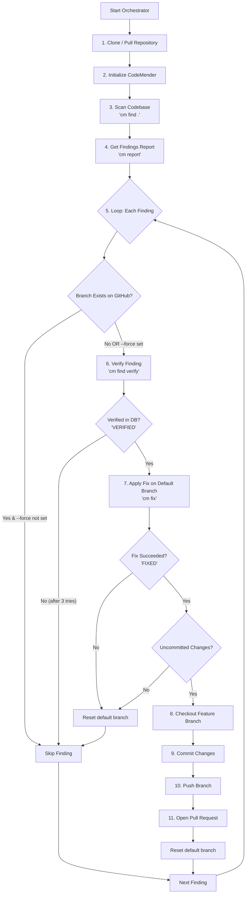

# CodeMender Orchestrator

The CodeMender Orchestrator is an automated execution runner designed to run
within an engineering team's own infrastructure (e.g., as a Google Cloud Run
Job). It automates local vulnerability scanning, validation, automated patching
via the CodeMender CLI (`cm`), and Pull Request generation on GitHub.

--------------------------------------------------------------------------------

## Architecture Overview (Bring Your Own Project - BYOP)

To validate and fix code vulnerabilities, CodeMender must run your codebase's
specific compilers, linters, and test suites. Because a central backend cannot
securely host thousands of custom environments, the orchestrator executes inside
your own secure container:

1.  **CodeMender Backend ("The Brain")**: Central LLM service that analyzes
    vulnerabilities and reasons about fixes.
2.  **CodeMender CLI (`cm`) ("The Translator")**: Local CLI tool handling server
    communication, workspace edits, and local test validation.
3.  **Custom Container Environment ("The Workshop")**: Cloud Run Job container
    holding `orchestrator.py`, the `cm` binary, and your language toolchains
    (Node.js, Go, Java, Python, etc.).
4.  **Orchestrator Script (`orchestrator.py`) ("The Manager")**: Clones code,
    runs scans (`cm find`), verifies findings (`cm verify`), applies fixes (`cm
    fix`), and creates Pull Requests on GitHub.

### Orchestration Flowchart



--------------------------------------------------------------------------------

## Key Constraints & Operational Rules

-   **Credential Scrubbing**: `orchestrator.py` explicitly scrubs sensitive
    credentials (`GITHUB_APP_TOKEN`, `GITHUB_PAT`, `GITHUB_TOKEN`) from the
    subprocess environment before invoking `cm` commands (`cm verify`, `cm fix`)
    to eliminate remote code execution (RCE) exfiltration risks.
-   **Single-Sync Git Rule**: The orchestrator syncs only once at the beginning
    of the scan (`git clone --depth 1`). Fixed branches are pushed directly to
    remote and PRs opened immediately, delegating merge conflict resolution to
    GitHub's PR mergeability checks.
-   **PR Spam Prevention**: Branch names are deterministically derived using a
    hash of `VulnType` + `FilePath` (e.g., `codemender/fix-sqli-a1b2c3d4`). If a
    branch already exists on origin, the orchestrator skips duplicate `cm fix`
    operations.
-   **Workspace Reset**: Uses forced branch checkout (`git checkout -f`) when
    switching branches between findings.
-   **GCS Summary Reports**: At the end of the orchestrator run, it
    automatically compiles an interactive HTML summary report (`cm report -f
    html`). If `CODEMENDER_REPORT_BUCKET` is configured, the report is uploaded
    to GCS and a secure, temporary Signed URL (valid for 3 days) is printed in
    the job output logs for easy developer review.

--------------------------------------------------------------------------------

## User Guides & Documentation

To set up, configure, and execute the CodeMender Orchestrator, refer to the
following dedicated markdown guides in the `docs/` folder:

*   📖 **[Local Run Guide](docs/guides/local_run.md)**: Steps to configure your
    developer workstation, install dependencies locally, and run the scanner
    manually for validation and quick debugging.
*   🚀 **[Production Run & Deployment Guide](docs/guides/production_run.md)**:
    Step-by-step instructions to provision GCS buckets, configure IAM roles,
    deploy Cloud Run Jobs, and automate daily scans using Cloud Scheduler.
*   🛡️
    **[Implementation Guardrails & Design](docs/architecture/guardrails.md)**:
    Architecture specifications, security constraints, and execution rules.
*   ⚡
    **[Parallelization Design Specification](docs/architecture/parallelization_design.md)**:
    Source of Truth for multi-stage sharded parallel scanning across GCP and
    GitHub Actions.

--------------------------------------------------------------------------------

## Repository Structure & Testing

```
.
├── orchestrator.py                 # CLI entrypoint
├── codemender_agent/               # Main Python package
│   ├── config.py                   # Config injection & credential scrubbing
│   ├── utils.py                    # Process execution & retry decorators
│   ├── storage.py                  # GCS report uploads & signed URLs
│   ├── vcs/                        # Git and GitHub API integrations
│   ├── codemender/                 # CodeMender CLI & SQLite state DB interface
│   └── runners/                    # Sequential and parallel execution pipelines
├── tests/                          # Modular unit test suite
├── docs/                           # Documentation, guides, and specifications
└── Dockerfile                      # Deployment container definition
```

### Running Unit Tests

Run the unit test suite across all submodules:

```bash
python3 -m unittest discover tests
```

## Future Work

-   **Automatic PR Re-opening on Force-Push**: When running in overwrite mode
    (`CODEMENDER_FORCE_OVERWRITE=true`), force-pushing new commits to a branch
    with a closed/unmerged PR is successful, but creating a new PR fails on
    GitHub API validation (HTTP 422). Future work should query existing pull
    requests and, if one is closed, programmatically re-open it via `PATCH
    /repos/{owner}/{repo}/pulls/{number}`.
-   **State Database Checkpointing (Persistence)**: Since Cloud Run Job
    execution is stateless, the SQLite state database (`~/.codemender/state.db`)
    is destroyed at the end of the run. A GCS checkpoint sync step should be
    introduced at startup and shutdown to pull/push the state database,
    preserving historically verified finding statuses (e.g., preserving manually
    flagged `FALSE_POSITIVE` or `RESOLVED` statuses).
-   **Workstation/Runner Command Injection Sandboxing**: Verification
    agent-generated exploit scripts (`exploit.sh`) are executed directly on the
    host VM/runner shell. Since these scripts are generated entirely by LLMs,
    malicious target project code could trigger command injections (exfiltrating
    Git secrets or accessing metadata services). Future work should isolate
    exploit verification executions inside an unprivileged Docker container or
    gVisor sandbox container.
