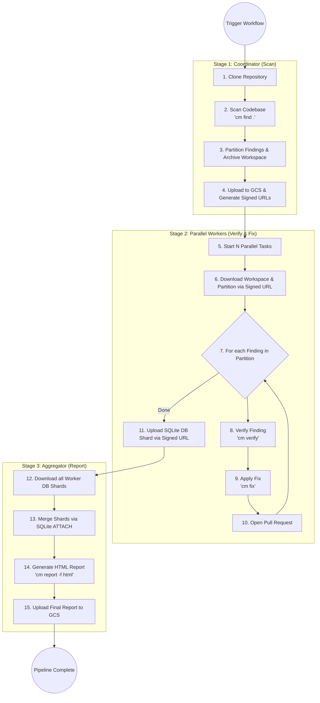

# CodeMender Orchestrator (Public Preview)

The CodeMender Orchestrator is an automated execution runner designed to run
within an engineering team's own infrastructure (e.g., as Google Cloud Run
Jobs). It automates local vulnerability scanning, validation, automated patching
via the CodeMender CLI (`cm`), and Pull Request generation on GitHub.

> [!IMPORTANT]
> **CodeMender Compatibility Warning**: This orchestrator was built and
> validated on top of **CodeMender CLI version
> `codemender-cli-v0.1.0-20260515-vMvg-916238397.zip`** and now officially
> supports the **CodeMender Public Preview** versions. Since the CodeMender CLI
> and its internal state database schema are actively under development,
> upgrading the `cm` binary to future unvalidated versions may introduce
> database schema or CLI output changes. If that occurs, modifications may be
> required to the orchestrator's parsers (`codemender_agent/codemender/`) and
> database merger (`codemender_agent/runners/aggregate.py`) to remain
> functional.

--------------------------------------------------------------------------------

## Architecture Overview (Parallel Pipeline)

To validate and fix code vulnerabilities, CodeMender must run your codebase's
specific compilers, linters, and test suites. Because a central backend cannot
securely host thousands of custom environments, the orchestrator executes inside
your own secure containers across a scalable, 3-stage pipeline orchestrated by
**Google Cloud Workflows**:

1.  **Stage 1: Coordinator (Scan)**: A privileged Cloud Run Job clones the
    repository, runs a full vulnerability scan (`cm find .`), partitions the
    findings into logical shards, and uploads the compressed workspace and a
    work manifest to a secure Google Cloud Storage (GCS) bucket.
2.  **Stage 2: Parallel Workers (Verify & Fix)**: Ephemeral, unprivileged Cloud
    Run Job tasks spin up concurrently (up to 100+ parallel tasks). Using the
    **Valet Key Pattern**, they download their assigned work via temporary
    Signed URLs. Each worker verifies findings (`cm find verify`), applies
    patches (`cm fix`), opens GitHub PRs for successful fixes, and uploads its
    local SQLite state database shard back to GCS.
3.  **Stage 3: Aggregator (Report)**: The coordinator job wakes back up,
    downloads all worker database shards, securely merges them using `SQLite
    ATTACH`, and generates a consolidated, interactive HTML vulnerability
    report.

### Orchestration Flowchart



--------------------------------------------------------------------------------

## Key Constraints & Operational Rules

-   **Secure Sandboxing (Valet Key Pattern)**: To protect your infrastructure
    from potentially malicious repository code executed during `cm verify`,
    Worker tasks have *zero* native IAM permissions to Cloud Storage. They
    interact with GCS strictly through temporary, cryptographically signed URLs
    generated by the Coordinator.
-   **Credential Scrubbing**: `orchestrator.py` explicitly scrubs sensitive
    credentials (`GITHUB_APP_TOKEN`, `GITHUB_PAT`, `GITHUB_TOKEN`, `GH_TOKEN`,
    `GITHUB_SECRET`) from the subprocess environment before invoking `cm`
    commands (`cm find verify`, `cm fix`) to eliminate remote code execution
    (RCE) exfiltration risks.
-   **Single-Sync Git Rule**: The orchestrator syncs only once at the beginning
    of Stage 1 (`git clone --depth 1`). Workers operate on exactly the same
    codebase snapshot. Fixed branches are pushed directly to remote and PRs
    opened immediately, delegating merge conflict resolution to GitHub's PR
    mergeability checks.
-   **PR Spam Prevention**: Branch names are deterministically derived using the
    finding `filePath`, `vulnType`, and `startLine`. To absorb minor LLM line
    number jitter, the workers query the GitHub API to check for open PRs with
    the same file and vulnerability type within a 15-line sliding window. If a
    branch or open PR already exists, the worker skips duplicate `cm fix`
    operations.
-   **GCS Summary Reports**: At the end of the pipeline, the aggregator
    automatically compiles an interactive HTML summary report (`cm report -f
    html`) and generates a secure, temporary Signed URL (valid for 3 days)
    printed in the job output logs for easy developer review.

--------------------------------------------------------------------------------

## User Guides & Documentation

To set up, configure, and execute the CodeMender Orchestrator, refer to the
following dedicated markdown guides in the `docs/` folder:

*   📖 **[Local Run Guide](docs/guides/local_run.md)**: Steps to configure your
    developer workstation, install dependencies locally, and run the scanner
    manually for validation and quick debugging.
*   🏭 **[Production Deployment Guide](docs/guides/production_run.md)**:
    Comprehensive instructions covering both Parallel Workflows and Sequential
    Jobs on Cloud Run.
*   🚀
    **[Automated Terraform Deployment Guide](docs/guides/terraform_deployment_guide.md)**:
    Step-by-step instructions to provision GCS buckets, configure IAM roles,
    deploy Cloud Run Jobs, and automate daily scans on GCP using Terraform.
*   🏗️
    **[GCP Deployment Automation Plan](docs/architecture/deployment_automation.md)**:
    Architecture and implementation guardrails for automated Terraform
    deployment.
*   🛡️
    **[Implementation Guardrails & Design](docs/architecture/guardrails.md)**:
    Architecture specifications, security constraints, and execution rules.
*   ⚙️ **[Configuration Reference](docs/guides/configuration_reference.md)**:
    Comprehensive list of all environment variables, flags, and
    `codemender.yaml` settings.
*   ⚡
    **[Parallelization Design Specification](docs/architecture/parallelization_design.md)**:
    Source of Truth for multi-stage sharded parallel scanning across GCP and
    GitHub Actions.
*   🆕
    **[Public Preview Upgrade Specification](docs/architecture/codemender_public_preview_upgrade_design.md)**:
    Architectural guardrails and backwards-compatibility specifications for the
    CodeMender Public Preview release.

--------------------------------------------------------------------------------

## Repository Structure & Testing

### Source Directory Structure

The repository is organized as a modular Python package with matching unit tests
and dedicated deployment files:

```
.
├── Dockerfile                      # Deployment container definition
├── README.md                       # High-level overview & setup documentation
├── cloudbuild.yaml                 # GCP Cloud Build definition
├── requirements.txt                # Python package dependencies
├── orchestrator.py                 # CLI entrypoint script
├── codemender_agent/               # Core orchestrator library
│   ├── __init__.py
│   ├── config.py                   # Config injection & environment credential scrubbing
│   ├── utils.py                    # Subprocess helpers, port freeing, and retry decorators
│   ├── storage.py                  # GCS file transfers & Signed URL generation helpers
│   ├── codemender/                 # Interface wrapper for CodeMender CLI
│   │   ├── __init__.py
│   │   ├── cli.py                  # JSON parsers for findings and session reports
│   │   └── db.py                   # SQLite status checkers (verify status, fix status)
│   ├── vcs/                        # Version Control System (VCS) integrations
│   │   ├── __init__.py
│   │   ├── git.py                  # Git CLI wrapper & deterministic branch naming
│   │   └── github.py               # GitHub API client (REST API endpoints for PRs & branches)
│   └── runners/                    # Pipeline runner scripts executing workflows
│       ├── __init__.py
│       ├── sequential.py           # Sequential single-task scanning & fixing loop
│       ├── scan.py                 # Stage 1: Parallel coordinator scanning & partitioning
│       ├── worker.py               # Stage 2: Ephemeral parallel fixing worker task
│       └── aggregate.py            # Stage 3: Database aggregator & report generator
├── tests/                          # Modular test suite shadowing package layout
│   ├── __init__.py
│   ├── cm                          # Mock executable mimicking cm CLI interactions
│   ├── dummy_cm.py                 # Mock Python server simulating the CodeMender backend
│   ├── test_config.py              # Config parser unit tests
│   ├── test_utils.py               # Subprocess & decorator unit tests
│   ├── test_storage.py             # GCS upload/download unit tests
│   ├── test_codemender_cli.py      # cm CLI parsing unit tests
│   ├── test_codemender_db.py       # Local database status checker unit tests
│   ├── test_command_builder.py     # Command builder & metric parsing unit tests
│   ├── test_vcs_git.py             # Git CLI wrapper and branch naming unit tests
│   ├── test_vcs_github.py          # GitHub API integration unit tests
│   ├── test_runners_scan.py        # Stage 1 Scan coordinator unit tests
│   ├── test_runners_worker.py      # Stage 2 Parallel worker unit tests
│   ├── test_runners_aggregate.py   # Stage 3 Database aggregator unit tests
│   └── e2e_test_local.py           # Mock local end-to-end integration test runner
├── workflows/
│   └── gcp_parallel_workflow.yaml  # GCP Cloud Workflows Orchestration YAML
├── terraform/                      # Automated infrastructure provisioning
│   └── gcp/                        # Google Cloud Platform Terraform modules
│       ├── apis.tf                 # GCP API enablement
│       ├── compute.tf              # Cloud Run Jobs & Cloud Workflows definitions
│       ├── iam.tf                  # Custom IAM roles and Service Accounts
│       ├── outputs.tf              # Deployment outputs and resource URLs
│       ├── provider.tf             # Terraform provider configuration
│       ├── scheduler.tf            # Cloud Scheduler cron jobs
│       ├── secret.tf               # Secret Manager for tokens
│       ├── storage.tf              # GCS Buckets and Artifact Registry
│       ├── variables.tf            # Configurable environment variables
│       ├── vpc.tf                  # Serverless VPC Access & Cloud NAT (Optional)
│       └── tests/                  # Terraform integration and unit tests (`terraform test`)
└── docs/                           # Architectural specs, guides, and runbooks
    ├── architecture/               # Design specifications and guardrails
    └── guides/                     # User, deployment, and configuration guides
```

### Running Unit Tests

Modular unit tests are written using the standard Python `unittest` module and
do not require GCP credentials or active Git permissions (uses mocks and dummy
wrappers).

*   **Run all unit tests**:

    ```bash
    python3 -m unittest discover tests
    ```

*   **Run a specific test suite** (e.g., Git utilities):

    ```bash
    python3 -m unittest tests/test_vcs_git.py
    ```

*   **Run local integration/simulation tests**: To simulate the end-to-end
    orchestrator pipeline locally without deploying containers or making live
    GitHub PRs:

    ```bash
    python3 tests/e2e_test_local.py
    ```

## Future Work

-   **Support for Alternate VCS Frameworks**: The current orchestrator is
    heavily coupled to Git and GitHub APIs. Future iterations should abstract
    the version control layer (`codemender_agent/vcs/`) to support Mercurial
    (hg) and other source control systems or Git-based hosting providers (e.g.,
    GitLab).
-   **Automated Deployment via GitHub Actions**: While comprehensive Terraform
    support exists for Google Cloud deployment, providing a native, automated
    setup pipeline using GitHub Actions would simplify onboarding for
    repositories that already use GitHub as their primary CI/CD platform.
-   **Automatic PR Re-opening on Force-Push**: When running in overwrite mode
    (`CODEMENDER_FORCE_OVERWRITE=true`), force-pushing new commits to a branch
    with a closed/unmerged PR is successful, but creating a new PR fails on
    GitHub API validation (HTTP 422). Future work should query existing pull
    requests and, if one is closed, programmatically re-open it via `PATCH
    /repos/{owner}/{repo}/pulls/{number}`.
-   **State Database Checkpointing (Persistence)**: Since Cloud Run Job
    execution is stateless, the SQLite state database (`~/.codemender/state.db`)
    is destroyed at the end of the run. A GCS checkpoint sync step should be
    introduced at startup and shutdown to pull/push the state database,
    preserving historically verified finding statuses (e.g., preserving manually
    flagged `FALSE_POSITIVE` or `RESOLVED` statuses).
