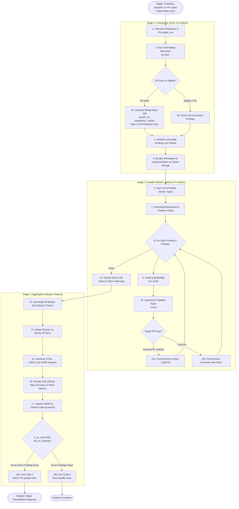

# CodeMender Orchestrator (Public Preview)

The CodeMender Orchestrator is an automated, multi-stage execution runner
designed to run within an engineering team's own infrastructure—both natively as
**GitHub Actions CI/CD workflows** and within **Google Cloud Platform (GCP Cloud
Run Jobs & Workflows)**. It automates local vulnerability scanning, AI-driven
verification, automated patch generation via the CodeMender CLI (`cm`), and
automated Pull Request creation on GitHub.

> [!IMPORTANT]
> **CodeMender Compatibility Warning**: This orchestrator was built
> and validated on top of **CodeMender CLI version
> `codemender-cli-v0.1.0-20260515-vMvg-916238397.zip`** and officially supports
> the **CodeMender Public Preview** versions. Since the CodeMender CLI and its
> internal state database schema are actively under development, upgrading the
> `cm` binary to future unvalidated versions may introduce database schema or
> CLI output changes. If that occurs, modifications may be required to the
> orchestrator's parsers (`codemender_agent/codemender/`) and database merger
> (`codemender_agent/runners/aggregate.py`) to remain functional.

--------------------------------------------------------------------------------

## Architecture Overview (Parallel Pipeline)

To validate and fix code vulnerabilities, CodeMender must run your codebase's
specific compilers, linters, and test suites. Because a central backend cannot
securely host thousands of custom build environments, the orchestrator executes
inside your own secure container runners across a scalable, 3-stage pipeline:

1.  **Stage 1: Coordinator / Scanner (`runners/scan.py`)**:
    -   Clones the target repository snapshot (or pins the exact Pull Request
        commit `target_sha`).
    -   Executes vulnerability discovery via `cm find .`.
    -   On Pull Request scans, performs **differential filtering** against
        merge-base diffs (`git diff -U0 origin/<base>...HEAD`) to isolate
        findings introduced or modified in the PR.
    -   Partitions actionable findings into balanced shards and bundles the
        repository workspace into transit storage.
2.  **Stage 2: Parallel Workers (`runners/worker.py`)**:
    -   Concurrently spins up ephemeral worker tasks (matrix jobs in GitHub
        Actions or parallel tasks in Cloud Run).
    -   Each worker downloads its assigned workspace and partition via the
        configured storage adapter.
    -   For each finding, the worker verifies exploitability (`cm verify`),
        generates and applies an automated patch (`cm fix`), and pushes a
        dedicated branch to GitHub.
    -   Opens a Child Pull Request targeting the feature/default branch (or
        posts a detailed review comment on Fork PRs) and exports its local
        SQLite state database shard and token telemetry.
3.  **Stage 3: Aggregator & Reporter (`runners/aggregate.py`)**:
    -   Collects all worker database shards and token usage files.
    -   Merges database shards via `SQLite ATTACH` and schema unification.
    -   Generates consolidated interactive HTML (`report.html`), structured JSON
        (`report.json`), and GitHub-compliant SARIF (`report.sarif`) reports.
    -   Emits a rich GitHub Step Summary with status breakdowns and LLM token
        metrics, uploads SARIF alerts to GitHub Code Scanning, and enforces the
        blocking **Security Quality Gate** on PR scans.

--------------------------------------------------------------------------------

## Orchestration Flowchart



--------------------------------------------------------------------------------

## Multi-Platform Deployment & Storage Adapters

The orchestrator abstracts transit storage and execution infrastructure across
multiple environments via `codemender_agent/storage.py`:

### 1. Native GitHub Actions Orchestration

*   **Workflow**: `.github/workflows/codemender_parallel.yml` (reusable workflow
    callable from any repository).
*   **Storage Mode**: `storage_mode: github_actions` using
    `GitHubActionsTransitStorageAdapter`.
*   **Zero-Storage Transit**: Requires **no external GCS bucket**. Workspace
    archives, partition manifests, and SQLite shards are passed seamlessly
    between Stage 1, Stage 2 matrix jobs, and Stage 3 using standard GitHub
    Actions artifact actions (`@actions/upload-artifact` and
    `@actions/download-artifact`).
*   **Authentication**: Seamless authentication with GitHub via GitHub App
    installation tokens or repository `GITHUB_TOKEN`, and GCP authentication via
    Workload Identity Federation (WIF) or Service Account keys for
    Gemini/CodeMender backend access.
*   **Runner Image**: Pre-built runner container images published to GitHub
    Packages / GHCR (`ghcr.io/<owner>/codemender-runner:latest`) via
    `.github/workflows/build_runner_image.yml`.

#### GitHub Actions Dual Scanning Modes: Scheduled Nightly vs. Pull Request Scans

The GitHub Actions workflow uniquely provides **two tailored scanning modes**
optimized for CI/CD developer feedback and ongoing repository health:

| Feature            | Scheduled Nightly Scan    | Pull Request Scan ("Clean   |
:                    :                           : as You Code")               :
| :----------------- | :------------------------ | :-------------------------- |
| **Trigger**        | Schedule                  | Pull Request labeled        |
:                    : (`schedule.cron`) or      : (`codemender-scan`),        :
:                    : manual                    : opened, or synchronized     :
:                    : (`workflow_dispatch`)     :                             :
| **Scope**          | Full repository audit     | **Differential scan**:      |
:                    : against default branch    : Analyzes only lines changed :
:                    : (`main`)                  : in the PR merge-base diff   :
| **Base Ref**       | Default branch head       | Pull Request target base    |
:                    : commit                    : ref (`origin/<base_ref>`)   :
| **Remediation**    | Opens Child PRs targeting | Opens Child PRs targeting   |
:                    : default branch (`main`)   : the developer's PR feature  :
:                    :                           : branch (`pr_head_ref`)      :
| **Fork PRs**       | N/A (runs on upstream     | Posts an inline PR review   |
:                    : repository)               : comment with patch diff and :
:                    :                           : git apply commands          :
| **Alerts & SARIF** | Uploads full SARIF alert  | Scoped SARIF upload         |
:                    : inventory with            : creating inline annotations :
:                    : `underReview`             : on PR **Files changed** and :
:                    : suppressions              : **Checks** tabs             :
| **Quality Gate**   | Non-blocking              | **Blocking Quality Gate**   |
:                    : (informational audit &    : (`fail_on_findings=true`)\: :
:                    : remediation pipeline)     : Fails check if active       :
:                    :                           : vulnerabilities remain      :
| **Step Summary**   | Full repository finding   | Scoped PR table; suppresses |
:                    : breakdown with LLM token  : legacy untouched tech debt  :
:                    : metrics                   : (`PRE_EXISTING_IGNORED`)    :

*   **Mode A: Scheduled Nightly Audits**: Designed to run off-peak (e.g. weekly
    or nightly) to perform a full codebase sweep, deduplicate against existing
    open fixes, open automated remediation PRs against `main`, and populate the
    GitHub Security Tab.
*   **Mode B: Pull Request CI/CD ("Clean as You Code")**: Designed for
    shift-left security. By calculating `git diff -U0 origin/<base>...HEAD`,
    CodeMender isolates vulnerabilities introduced by the PR, ignores
    pre-existing legacy issues to avoid developer fatigue, opens child PRs
    directly against the feature branch, and acts as a blocking status check
    before merge.

### 2. Google Cloud Platform (GCP) Deployment

*   **Orchestrator**: Cloud Workflows (`workflows/gcp_parallel_workflow.yaml`)
    coordinating Cloud Run Jobs.
*   **Storage Mode**: `storage_mode: gcs` using `GCSTransitStorageAdapter`.
*   **Valet Key Pattern**: Ephemeral workers run with zero IAM permissions to
    Cloud Storage, interacting strictly via temporary, cryptographically signed
    V4 URLs generated by the Coordinator.
*   **Automated Provisioning**: Ready-to-deploy Terraform modules
    (`terraform/gcp/`) provisioning Cloud Run Jobs, Cloud Workflows, GCS
    buckets, Secret Manager, and Cloud Scheduler cron triggers.

--------------------------------------------------------------------------------

## Key Constraints & Operational Rules

-   **Secure Sandboxing & Zero-Privilege Workers**: In GCP mode, worker tasks
    have *zero* native IAM permissions to Cloud Storage and interact strictly
    via signed URLs. In GitHub Actions mode, worker matrix jobs execute inside
    isolated runner sandboxes (`--privileged` container execution for namespace
    isolation).
-   **Credential Scrubbing**: `orchestrator.py` explicitly scrubs sensitive
    credentials (`GITHUB_APP_TOKEN`, `GITHUB_PAT`, `GITHUB_TOKEN`, `GH_TOKEN`,
    `GITHUB_SECRET`, `GCP_SA_KEY`) from the subprocess environment before
    invoking `cm` commands (`cm verify`, `cm fix`) to eliminate remote code
    execution (RCE) exfiltration risks.
-   **Single-Sync Git Rule & Commit Pinning**: The orchestrator synchronizes the
    repository only once during Stage 1 (`git clone`). On Pull Request scans,
    `target_sha` is strictly pinned and checked out across workers and
    aggregators to eliminate base ref drift during parallel execution.
-   **PR Spam Prevention & Sliding Window Deduplication**: Branch names are
    deterministically derived using finding attributes (`filePath`, `vulnType`,
    `startLine`). The orchestrator queries GitHub to check for existing open PRs
    within a 15-line sliding window, skipping duplicate `cm fix` operations.
-   **Fork Pull Request Safe Handling**: For PRs submitted from fork
    repositories where push permissions are unavailable, the worker
    automatically avoids push failures and instead publishes an actionable PR
    review comment containing git patch instructions.
-   **Differential PR Scanning ("Clean as You Code")**: On PR scans, the
    coordinator evaluates merge-base diffs (`git diff -U0 origin/<base>...HEAD`)
    and flags pre-existing findings as `PRE_EXISTING_IGNORED`, suppressing
    legacy finding noise and focusing developer attention strictly on newly
    introduced vulnerabilities.
-   **Security Quality Gate**: Pull Request scans enforce a blocking quality
    check (`fail_on_findings=true`). If fixable or verified vulnerabilities
    remain on the PR diff, Stage 3 exits with code 1 after publishing full SARIF
    and reports, preventing vulnerable code from merging to `main`.
-   **Sanitized SARIF Reporting**: Trailing CLI process logs and out-of-tree
    traversal paths (`../`) are safely sanitized, ensuring 100% valid JSON
    serialization for GitHub Code Scanning integration.
-   **Aggregated Token Metrics & HTML Reports**: Aggregators dynamically
    accumulate LLM token usage across all parallel workers and embed an
    interactive token usage banner into the generated HTML report.

--------------------------------------------------------------------------------

## User Guides & Documentation

To set up, configure, and execute the CodeMender Orchestrator, refer to the
dedicated guides in the `docs/` folder:

*   🐙
    **[GitHub Actions Integration Guide](docs/guides/github_actions_guide.md)**:
    End-to-end setup guide covering GitHub App onboarding, Actions secrets,
    Workload Identity Federation (WIF), reusable caller workflows, and
    troubleshooting.
*   ⚙️ **[Configuration Reference](docs/guides/configuration_reference.md)**:
    Comprehensive reference of all environment variables, workflow inputs, and
    AI model configurations (linking to
    [CodeMender Model Documentation](https://docs.cloud.google.com/gemini-enterprise-agent-platform/codemender#specifying-the-model)).
*   📖 **[Local Run Guide](docs/guides/local_run.md)**: Instructions to configure
    your local workstation, install dependencies, and run the scanner manually
    for validation and debugging.
*   🏭 **[Production Deployment Guide (GCP)](docs/guides/production_run.md)**:
    Deployment guide for Parallel Workflows and Sequential Jobs on Google Cloud
    Run.
*   🚀
    **[Automated Terraform Deployment Guide](docs/guides/terraform_deployment_guide.md)**:
    Step-by-step instructions to provision GCP infrastructure using Terraform.
*   ⚡
    **[GitHub Actions Orchestration Architecture](docs/architecture/github_actions_orchestration_design.md)**:
    Detailed architectural design for native GitHub Actions matrix
    orchestration.
*   ⚡
    **[GCP Parallelization Design Specification](docs/architecture/parallelization_design.md)**:
    Specification for multi-stage sharded parallel execution on GCP.
*   🛡️
    **[Implementation Guardrails & Design](docs/architecture/guardrails.md)**:
    Security constraints, Valet Key pattern, and execution guardrails.
*   🆕
    **[Public Preview Upgrade Specification](docs/architecture/codemender_public_preview_upgrade_design.md)**:
    Compatibility specifications for the CodeMender Public Preview release.
*   🔮 **[Future Work & Technical Debt Roadmap](docs/future_work.md)**:
    Architectural roadmap, service layer decomposition plans, and planned
    enhancements.

--------------------------------------------------------------------------------

## Repository Structure & Testing

### Source Directory Structure

The repository is organized as a modular Python package with complete unit test
coverage, GitHub Actions workflows, Terraform modules, and architecture
documentation:

```
.
├── Dockerfile                          # Deployment container definition (Python 3.11 + cm CLI + Git)
├── README.md                           # High-level overview & setup documentation
├── cloudbuild.yaml                     # GCP Cloud Build runner definition
├── orchestrator.py                     # CLI entrypoint script (config loader & runner dispatcher)
├── requirements.txt                    # Python package dependencies
├── .github/
│   └── workflows/
│       ├── build_runner_image.yml      # CI workflow to build & publish runner Docker image to GHCR
│       └── codemender_parallel.yml     # Reusable 3-stage parallel matrix GitHub Actions workflow
├── codemender_agent/                   # Core orchestrator package
│   ├── __init__.py
│   ├── config.py                       # OrchestratorConfig model & environment credential scrubbing
│   ├── storage.py                      # Storage adapters (GitHub Actions Transit, GCS, Local)
│   ├── utils.py                        # Subprocess helpers, token parsers, retry decorators, port cleanup
│   ├── codemender/                     # CodeMender CLI wrapper
│   │   ├── __init__.py
│   │   ├── cli.py                      # JSON parsers for findings and session reports
│   │   └── db.py                       # SQLite database status queries (verify status, fix status)
│   ├── vcs/                            # Version Control System (VCS) integrations
│   │   ├── __init__.py
│   │   ├── git.py                      # Git CLI wrapper, diff parser, path normalization, branch naming
│   │   └── github.py                   # GitHub REST API client (PR creation, comments, branch checks)
│   └── runners/                        # Pipeline execution runners
│       ├── __init__.py
│       ├── scan.py                     # Stage 1: Scan coordinator, PR differential filter, partitioning
│       ├── worker.py                   # Stage 2: Ephemeral parallel worker (verify, fix, PR creation)
│       ├── aggregate.py                # Stage 3: Database merger, HTML/SARIF/Step Summary, Quality Gate
│       └── sequential.py               # Sequential single-task scanning & fixing loop (local/debug)
├── tests/                              # Comprehensive test suite (70/70 unit tests)
│   ├── __init__.py
│   ├── cm                              # Mock executable mimicking cm CLI interactions
│   ├── dummy_cm.py                     # Mock Python server simulating CodeMender backend
│   ├── e2e_test_local.py               # Mock local end-to-end multi-stage pipeline integration test
│   ├── test_codemender_cli.py          # cm CLI parsing unit tests
│   ├── test_codemender_db.py           # SQLite database status queries unit tests
│   ├── test_command_builder.py         # CLI command builder & token metric parsing unit tests
│   ├── test_config.py                  # Configuration loader & credential scrubbing unit tests
│   ├── test_runners_aggregate.py       # Stage 3 Aggregator, SARIF sanitization, and Quality Gate unit tests
│   ├── test_runners_scan.py            # Stage 1 Scan coordinator & PR differential filtering unit tests
│   ├── test_runners_worker.py          # Stage 2 Parallel worker & Child PR/Fork comment unit tests
│   ├── test_storage.py                 # Storage adapters & GCS Signed URL unit tests
│   ├── test_utils.py                   # Subprocess execution, port freeing, & JSON extraction unit tests
│   ├── test_vcs_git.py                 # Git wrapper, diff hunk parsing, & path normalization unit tests
│   └── test_vcs_github.py              # GitHub REST API integration unit tests
├── workflows/
│   └── gcp_parallel_workflow.yaml      # GCP Cloud Workflows parallel orchestration YAML
├── terraform/                          # Automated GCP infrastructure provisioning
│   └── gcp/                            # Google Cloud Platform Terraform modules
│       ├── apis.tf                     # GCP API enablement
│       ├── compute.tf                  # Cloud Run Jobs & Cloud Workflows definitions
│       ├── iam.tf                      # Custom IAM roles and Service Accounts
│       ├── outputs.tf                  # Deployment outputs and resource URLs
│       ├── provider.tf                 # Terraform provider configuration
│       ├── scheduler.tf                # Cloud Scheduler cron triggers
│       ├── secret.tf                   # Secret Manager configuration for tokens
│       ├── storage.tf                  # GCS Buckets and Artifact Registry
│       ├── variables.tf                # Configurable Terraform variables
│       ├── vpc.tf                      # Serverless VPC Access & Cloud NAT
│       └── tests/                      # Terraform integration tests (`terraform test`)
└── docs/                               # Architectural specifications, guides, and runbooks
    ├── future_work.md                  # Future roadmap and technical debt tracker
    ├── architecture/                   # Architectural designs & specifications
    │   ├── codemender_public_preview_upgrade_design.md
    │   ├── deployment_automation.md
    │   ├── github_actions_orchestration_design.md
    │   ├── guardrails.md
    │   └── parallelization_design.md
    └── guides/                         # User, deployment, and configuration guides
        ├── configuration_reference.md
        ├── github_actions_guide.md
        ├── local_run.md
        ├── production_run.md
        └── terraform_deployment_guide.md
```

--------------------------------------------------------------------------------

### Running Unit Tests

Modular unit tests are written using the standard Python `unittest` module and
do not require external credentials or live cloud resources:

*   **Run all unit tests**:

    ```bash
    python3 -m unittest discover tests -v
    ```

*   **Run a specific test suite** (e.g., Git utilities or Aggregator runner):

    ```bash
    python3 -m unittest tests/test_vcs_git.py -v
    python3 -m unittest tests/test_runners_aggregate.py -v
    ```

*   **Run local end-to-end simulation**:

    ```bash
    python3 tests/e2e_test_local.py
    ```

--------------------------------------------------------------------------------

## Future Work

For a detailed breakdown of planned architectural enhancements, see
**[docs/future_work.md](docs/future_work.md)**. Key roadmap items include:

-   **Modular Service Layer Refactoring**: Decomposing monolithic runner modules
    into specialized services (`VCSStagingService`, `DatabaseMergerService`,
    `ReportGenerationService`, `CLIExecutionService`).
-   **Support for Alternate VCS & Forge Providers**: Abstracting the VCS
    provider layer to support GitLab, Bitbucket, and Mercurial (`hg`).
-   **Automatic PR Re-opening on Force-Push**: Programmatically re-opening
    closed PRs via GitHub API when force-pushing updated patches in overwrite
    mode.
-   **Persistent State Database Checkpointing**: Synchronizing the SQLite state
    database (`~/.codemender/state.db`) to persistent storage across runs to
    preserve historical verification status.
