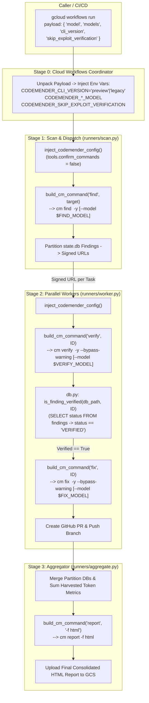

# CodeMender Orchestrator: Public Preview Upgrade Specification & Guardrails

This document serves as the absolute source of truth and architectural
guardrails for upgrading the **CodeMender Orchestrator** to support the
**CodeMender Public Preview** release while preserving complete backward
compatibility with internal/legacy releases within a **single codebase**.

--------------------------------------------------------------------------------

## 1. The Problem

Google is releasing **CodeMender Public Preview**, which introduces top-level
verification commands (`cm verify <FINDING_ID> -y`), mandatory pre-GA
interactive safety disclaimers (`--bypass-warning`), granular per-command AI
model selection (`--model`), and updated YAML configuration schemas. Enterprise
security teams need to upgrade their automated Cloud Workflows and Cloud Run
scanning pipelines to leverage these new capabilities without breaking existing
internal or legacy deployments. To ensure seamless adoption across diverse
environments, the CodeMender Orchestrator must support both Legacy and Public
Preview releases within a single, unified codebase.

--------------------------------------------------------------------------------

## 2. The Technical Plan

The CodeMender Orchestrator is a stateless, distributed orchestration layer
around the `cm` CLI binary and its SQLite state database
(`~/.codemender/state.db`). It executes across four major stages orchestrated by
**Cloud Workflows** and deployed on **Google Cloud Run**:

1.  **Stage 0: Cloud Workflows Coordinator**: Receives execution requests via
    JSON payloads (`gcloud workflows run ... --data='{...}'`), unpacks
    parameters, and injects standardized environment variables into Cloud Run
    job containers.
2.  **Stage 1: Scan & Dispatch (`runners/scan.py`)**: Clones/syncs the target
    repository, configures `~/.codemender/config.yaml`, runs codebase
    vulnerability scans (`cm find`), and partitions discovered findings into
    individual GCS task buckets.
3.  **Stage 2: Parallel Workers (`runners/worker.py`)**: Executes in parallel
    containers across finding partitions. Each worker verifies finding
    exploitability (`cm verify`), generates and applies security patches (`cm
    fix`), and submits GitHub Pull Requests for confirmed remediations.
4.  **Stage 3: Aggregation (`runners/aggregate.py`)**: Merges SQLite database
    partitions from all workers, consolidates token consumption metrics,
    generates final HTML/JSON security reports (`cm report`), and uploads them
    to Google Cloud Storage.

### Universal Version Gating & Command Building

All version-dependent behavior across the Orchestrator is governed by an
explicit environment variable: **`CODEMENDER_CLI_VERSION`** (`"preview"` vs.
`"legacy"`).

-   A central command builder (`build_cm_command` in `utils.py`) constructs CLI
    argument lists dynamically based on `CODEMENDER_CLI_VERSION` and resolved
    model flags.
-   In `"preview"` mode, the command builder automatically injects mandatory
    pre-GA guardrail bypasses (`--bypass-warning`) strictly on commands that
    prompt for safety disclaimers (`cm verify` and `cm fix`), while injecting
    auto-approve flags (`-y`) across scanning, verification, and patching.
-   Model selection uses a hierarchical precedence engine
    (`CODEMENDER_<CMD>_MODEL` -> `CODEMENDER_MODEL` -> default), appending
    `--model <MODEL>` per subcommand.

### End-to-End System Architecture



--------------------------------------------------------------------------------

## 3. Alternatives (Considered & Ruled Out)

To serve as guardrails against future architectural drift or regression, the
following major design alternatives were evaluated and explicitly rejected
during engineering discussions:

### 1. Building and Deploying Separate Orchestrator Versions/Branches for Legacy vs. Public Preview

-   **What was considered:** Maintaining a `legacy` Git branch for internal
    deployments and a `main`/`preview` branch for Public Preview deployments.
-   **Why it was ruled out:** Maintaining multiple code branches duplicates
    CI/CD pipelines, splits bug fixes, and creates deployment drift. Because the
    differences between CodeMender releases are cleanly bounded to CLI argument
    syntax and optional flags, a single codebase with clean version gating
    (`CODEMENDER_CLI_VERSION`) is significantly simpler and more reliable.

### 2. Auto-Detecting CLI Capability/Version at Runtime

-   **What was considered:** Executing `cm --version` or probing `cm verify
    --help` at container startup to dynamically decide whether to invoke `cm
    verify <ID> -y` or legacy `cm find verify <ID> --yes`.
-   **Why it was ruled out:** Dynamic probing adds unnecessary startup latency,
    can fail in minimal container environments if version output formats change,
    and obscures deployment intent. Requiring an explicit environment variable
    (`CODEMENDER_CLI_VERSION="preview"|"legacy"`) makes version gating
    deterministic, inspectable, and explicit in Terraform/Workflows definitions.

### 3. Global Injection of `--bypass-warning` Across All CLI Commands

-   **What was considered:** Appending `--bypass-warning` to all CodeMender
    commands in `"preview"` mode, including `cm init`, `cm report`, and `cm
    clean`.
-   **Why it was ruled out:** We empirically verified that in CodeMender Public
    Preview, only `cm verify` and `cm fix` prompt for the pre-GA interactive
    safety disclaimer. Read-only and local utility commands (`cm report`, `cm
    init`, `cm clean`) do not emit the warning and reject the flag. Passing
    `--bypass-warning` globally causes standard CLI parsers to crash with
    `error: unknown flag: --bypass-warning`. We restrict `--bypass-warning`
    strictly to `verify` and `fix`.

### 4. Relying on SQLite `verified == 1` Integer Column or Assuming `status` Remains `'OPEN'` After `cm verify`

-   **What was considered:** Based on preliminary documentation listing only
    `OPEN`, `FIXED`, `DISMISSED`, and `REOPENED` finding states, we hypothesized
    that `cm verify` left `status = 'OPEN'` while toggling an integer column
    `verified = 1`.
-   **Why it was ruled out:** We empirically validated against live SQLite
    database dumps (`~/.codemender/state.db`) that when a finding is verified
    (even with `--skip-exploit-verification`), CodeMender explicitly promotes
    the finding's canonical `status` column from `'OPEN'` to `'VERIFIED'`.
    Checking `SELECT status FROM findings WHERE finding_id = ?` and verifying
    `status == "VERIFIED"` is authoritative across both Legacy and Public
    Preview releases, eliminating complex dual-column schema checks.

### 5. Passing `--compact` to Stream Live Token Usage in Cloud Run Logs

-   **What was considered:** Passing `--compact` on `cm find`, `cm verify`, and
    `cm fix` to view live rolling token tickers (`Tokens: 40k in / 12k out / 60k
    total`).
-   **Why it was ruled out:** In headless Cloud Run containers where standard
    output is captured by Google Cloud Logging, carriage-return tickers (`\r`)
    cannot overwrite terminal lines. Every update flush produces a brand new log
    entry, flooding log buckets with hundreds of repetitive lines per scan and
    burying debugging traces. We omit `--compact` and instead regex-harvest the
    automatic completion line (`✅ Completed X tool steps... | Tokens: 41k in /
    561 out / 42k total`) upon command exit.

--------------------------------------------------------------------------------

## 4. Detailed Implementation Plan

This section enumerates every single file in
`/google/src/cloud/xinweizhang/fde-playground/google3/experimental/users/xinweizhang/git/codemender-agent`
that will be created or modified to implement the multi-version upgrade, along
with precise rationale and behavioral specifications.

### 1. `codemender_agent/utils.py`

-   **Why change:** This module houses shared subprocess execution and system
    utilities. It must become the single authority for CLI command argument
    building, model precedence resolution, and token usage harvesting.
-   **Detailed changes:**
    1.  Add `resolve_command_model(command_name: str) -> Optional[str]`:
        -   Implements a strict 3-tier lookup hierarchy:
        -   Tier 1: Check
            `os.environ.get(f"CODEMENDER_{command_name.upper()}_MODEL")`
            (`CODEMENDER_FIND_MODEL`, `CODEMENDER_VERIFY_MODEL`,
            `CODEMENDER_FIX_MODEL`).
        -   Tier 2: Check global fallback `os.environ.get("CODEMENDER_MODEL")`.
        -   Tier 3: Return `None` (allowing the CLI binary to use its built-in
            default model: `gemini-3.5-flash`).
    2.  Add `build_cm_command(cm_binary: str, action: str, target_or_id:
        Optional[str] = None, cli_version: str = "preview", extra_flags:
        Optional[List[str]] = None) -> List[str]`:
        -   Centralizes all CodeMender command argument construction.
        -   **In `"preview"` mode (`cli_version == "preview"`):**
        -   For `"find"`: Returns `[cm_binary, "find", target_or_id, "-y"]` +
            optional `["--model", model]`.
        -   For `"verify"`: Returns `[cm_binary, "verify", target_or_id, "-y",
            "--bypass-warning"]` + optional `["--model", model]`. If
            `os.environ.get("CODEMENDER_SKIP_EXPLOIT_VERIFICATION",
            "false").lower() == "true"`, appends `--skip-exploit-verification`.
        -   For `"fix"`: Returns `[cm_binary, "fix", target_or_id, "-y",
            "--bypass-warning"]` + optional `["--model", model]`.
        -   For `"report"`, `"init"`, `"clean"`: Returns base command
            `[cm_binary, action]` without execution guardrail flags.
        -   **In `"legacy"` mode (`cli_version == "legacy"`):**
        -   For `"find"`: Returns `[cm_binary, "find", target_or_id]`.
        -   For `"verify"`: Returns legacy nested syntax `[cm_binary, "find",
            "verify", target_or_id, "--yes"]`.
        -   For `"fix"`: Returns legacy syntax `[cm_binary, "fix", target_or_id,
            "--yes"]`.
    3.  Update `run_command(...)`:
        -   After process completion, inspect `process.stdout` using regular
            expression
            `r"Tokens:\s*([0-9.kM]+)\s*in\s*/\s*([0-9.kM]+)\s*out\s*/\s*([0-9.kM]+)\s*total"`.
        -   If matched, attach the parsed tuple `token_usage = (in_tokens,
            out_tokens, total_tokens)` to the returned
            `subprocess.CompletedProcess` object so runners can record token
            consumption without live ticker spam.

### 2. `codemender_agent/config.py`

-   **Why change:** Hides workspace initialization details and YAML config
    generation (`~/.codemender/config.yaml`). Must inject schemas compatible
    with both Legacy and Public Preview releases.
-   **Detailed changes:**

    1.  In `inject_codemender_config(repo_dir: str)`:

        -   Check `CODEMENDER_CLI_VERSION` from `os.environ`. If unset, default
            to `"legacy"` to safeguard existing environments, but emit a
            `logger.warning` advising operators to declare
            `CODEMENDER_CLI_VERSION="preview"`.
        -   Always inject nested guardrail flags under `tools`:

        ```yaml
        tools:
          confirm_commands: false
          confirm_writes: false
        ```

        *(Confirmed natively compatible with Public Preview default
        `config.yaml`).* - If `os.environ.get("CODEMENDER_MODEL")` is present,
        inject `model: "<CODEMENDER_MODEL>"` at the root level of `config.yaml`
        as the workspace fallback model. - Preserve existing `.codemender.yaml`
        repository-level merge logic so project-specific language whitelists
        (`scan.extensions.include`) take precedence.

### 3. `codemender_agent/codemender/db.py`

-   **Why change:** Contains SQLite database query helpers (`state.db`). Must
    verify finding verification status accurately across all releases.
-   **Detailed changes:**
    1.  In `is_finding_verified(db_path: str, finding_id: str) -> bool`:
        -   Continue querying `SELECT status FROM findings WHERE finding_id =
            ?`.
        -   Check `return status == "VERIFIED"`.
        -   *Rationale:* Empirically validated that both Legacy (`cm find
            verify`) and Public Preview (`cm verify` with or without
            `--skip-exploit-verification`) explicitly promote `status` to
            `'VERIFIED'`. No dual-column schema branching is required.

### 4. `codemender_agent/runners/scan.py`

-   **Why change:** Stage 1 runner responsible for initializing the workspace,
    executing `cm find`, and generating task partitions.
-   **Detailed changes:**
    1.  In `_init_codemender`: Replace inline command lists with
        `build_cm_command(cm_binary, "init", cli_version=cli_version)`.
    2.  In `_scan_repository`: Replace inline scan calls `[cm_binary, "find",
        target]` with `build_cm_command(cm_binary, "find", target,
        cli_version=cli_version)`.
    3.  In `_scan_repository` and `run_scan_pipeline`: Extract harvested
        `token_usage` metrics from `run_command` results and include them in the
        generated Stage 1 `manifest.json` uploaded to Google Cloud Storage.

### 5. `codemender_agent/runners/worker.py`

-   **Why change:** Stage 2 runner responsible for parallel vulnerability
    verification and remediation.
-   **Detailed changes:**
    1.  In `_process_finding`:
        -   Replace inline verification call `[cm_binary, "find", "verify",
            finding_id, "--yes"]` with `build_cm_command(cm_binary, "verify",
            finding_id, cli_version=cli_version)`.
        -   Replace inline fix call `[cm_binary, "fix", finding_id, "--yes"]`
            with `build_cm_command(cm_binary, "fix", finding_id,
            cli_version=cli_version)`.
        -   Ensure `git clean -fd -e .cm_project -e .exploit` is preserved
            intact, protecting CodeMender's 2-phase verification harness
            artifact folder (`.exploit/`).
    2.  In `run_worker_pipeline`: Record harvested token metrics from
        verification and fix commands into the worker's partition state
        database/manifest.

### 6. `codemender_agent/runners/sequential.py`

-   **Why change:** Single-node sequential runner used for local development and
    non-distributed testing.
-   **Detailed changes:**
    1.  Replace inline command invocations for `find`, `verify`, and `fix` with
        `build_cm_command(cm_binary, action, target_or_id,
        cli_version=cli_version)`.

### 7. `codemender_agent/runners/aggregate.py`

-   **Why change:** Stage 3 aggregator responsible for merging worker databases,
    producing consolidated HTML/JSON reports, and uploading to GCS.
-   **Detailed changes:**
    1.  Replace inline `cm report` execution with `build_cm_command(cm_binary,
        "report", extra_flags=["-f", "html"], cli_version=cli_version)`.
    2.  Add token metric aggregation: Read harvested token usage counts across
        all Stage 1 and Stage 2 worker partition manifests, compute cumulative
        totals (`total_in`, `total_out`, `total_combined`), and log/prepend a
        prominent usage summary header into the consolidated reporting metadata
        before uploading to GCS.

### 8. `tests/test_cli.py` & `tests/test_config.py` (or new `tests/test_command_builder.py`)

-   **Why change:** Ensures zero regression and rigorous automated verification
    of the multi-version adapter logic.
-   **Detailed changes:**
    1.  Add unit tests for `resolve_command_model(command_name)` verifying that
        granular variables (`CODEMENDER_FIND_MODEL`) override global variables
        (`CODEMENDER_MODEL`), which override default empty fallbacks.
    2.  Add unit tests for `build_cm_command(...)` verifying:
        -   In `"preview"` mode: `-y` is injected on `find`, `verify`, and
            `fix`; `--bypass-warning` is injected **only** on `verify` and
            `fix`; `--model` is appended correctly;
            `--skip-exploit-verification` is appended when
            `CODEMENDER_SKIP_EXPLOIT_VERIFICATION="true"`.
        -   In `"legacy"` mode: Legacy `find verify` syntax is produced without
            `--bypass-warning` or unsupported flags.
    3.  Add unit tests for `is_finding_verified(...)` verifying `status ==
        "VERIFIED"` against SQLite database test fixtures.

### 9. `docs/guides/terraform_deployment_guide.md`

-   **Why change:** Documentation serving as deployment guidance for
    infrastructure and DevOps teams.
-   **Detailed changes:**
    1.  Update Step 5 execution payload examples to document the new Cloud
        Workflows execution data fields:
        -   `"cli_version": "preview"` (or `"legacy"`)
        -   `"model": "gemini-3.5-flash"` (global default)
        -   `"models": { "find": "gemini-3-flash-preview", "verify":
            "gemini-3.5-flash", "fix": "gemini-3.1-pro-preview" }` (granular
            per-command override)
        -   `"skip_exploit_verification": true` (for safe containerized
            verification without active live database payloads).

--------------------------------------------------------------------------------

## 5. Behavioral Reference Summary Table

Operation / Component   | `CODEMENDER_CLI_VERSION == "preview"` (Default for New Deployments)                                   | `CODEMENDER_CLI_VERSION == "legacy"` (Backward Compatibility Mode)
:---------------------- | :---------------------------------------------------------------------------------------------------- | :-----------------------------------------------------------------
**Scan (`find`)**       | `cm find <target> -y [--model $CODEMENDER_FIND_MODEL]`                                                | `cm find <target>`
**Verify (`verify`)**   | `cm verify <ID> -y --bypass-warning [--skip-exploit-verification] [--model $CODEMENDER_VERIFY_MODEL]` | `cm find verify <ID> --yes`
**Fix (`fix`)**         | `cm fix <ID> -y --bypass-warning [--model $CODEMENDER_FIX_MODEL]`                                     | `cm fix <ID> --yes`
**Report (`report`)**   | `cm report --format json`                                                                             | `cm report --format json`
**Guardrails Config**   | `tools.confirm_commands: false`<br/>`tools.confirm_writes: false`                                     | `tools.confirm_commands: false`<br/>`tools.confirm_writes: false`
**SQLite Verify Check** | `SELECT status FROM findings WHERE finding_id = ?`<br/>True if `status == "VERIFIED"`                 | `SELECT status FROM findings WHERE finding_id = ?`<br/>True if `status == "VERIFIED"`
**Token Logging**       | Omit `--compact`; regex-harvest exit line (`✅ Completed...                                            | Tokens: ...`)
