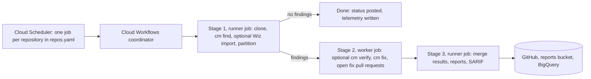

# CodeMender Orchestrator

The CodeMender Orchestrator runs Google CodeMender against your GitHub
repositories from your own Google Cloud project. It finds vulnerabilities,
optionally verifies them, proposes fixes as pull requests, and publishes the
results to GitHub code scanning and BigQuery.

It runs in your Google Cloud project and your GitHub organization: your code
is cloned into Cloud Run jobs that you own, and CodeMender's model calls go to
Vertex AI in your project.

## Who this is for

| Team | Start with |
| --- | --- |
| Platform team (deploys and operates it) | [Before you start](#before-you-start), then the [GitOps guide](../guides/gitops_cloud_build.md) and [Operations](operations.md) |
| Security team (reviews it, triages results) | [Security model](#security-model), [Where results show up](#where-results-show-up) and [How it works](how_it_works.md) |
| Application teams (own the scanned repositories) | [Where results show up](#where-results-show-up) and [Onboard a repository](#onboard-a-repository) |

## Which flow do I use?

| You want to | Flow | Runs on |
| --- | --- | --- |
| Scan whole repositories on a schedule and get fix pull requests | **Scheduled scans** (the main flow) | Your Google Cloud project: Cloud Scheduler, Cloud Workflows, Cloud Run jobs |
| Check each pull request for newly introduced vulnerabilities | **Pull request scans** (optional, advisory at first) | GitHub Actions in each repository |
| Change what is scanned, or how the deployment is set up | **GitOps deployment changes** | Cloud Build, triggered by pull requests to your copy of this repository |

Scheduled full-repository scans run on Google Cloud. GitHub Actions is used for
pull request scans only. (The GitHub Actions workflow can also run scheduled
scans, but that is not the supported path in this setup.)

## How it works

A scheduled scan runs in three stages. Stage 1 clones the repository and runs
`cm find`. If there are findings, Stage 2 runs parallel workers that fix them
and open pull requests. Stage 3 merges the results and publishes them.



[How it works](how_it_works.md) has the detailed diagrams for all three flows,
where the data lives, and the full security model.

## What gets deployed in your project

`<prefix>` is `resource_prefix` from `deployment.yaml` (default `codemender`).

| Resource | Name | Purpose |
| --- | --- | --- |
| Cloud Scheduler jobs | `<prefix>-scan-<name>`, one per entry in `repos.yaml` | Start a scan on the entry's schedule |
| Cloud Workflows workflow | `<prefix>-coordinator` | Runs the three stages in order |
| Cloud Run jobs | `<prefix>-runner` (stages 1 and 3), `<prefix>-worker` (stage 2) | Run the orchestrator and the CodeMender CLI (`cm`) |
| Cloud Storage bucket | `<prefix>-reports-<project>` | Scan workspaces and HTML reports; objects are deleted after 90 days |
| Artifact Registry repository | `<prefix>-runner` | The runner container image |
| Secret Manager secrets | See [Operations](operations.md#github-credentials) | GitHub App private key; optional Wiz credentials |
| BigQuery dataset | `codemender_telemetry` (configurable) | Scan history and findings, if telemetry is on (the default) |
| Service accounts | `<prefix>-runner-sa`, `<prefix>-worker-sa`, `<prefix>-workflows-sa`, `<prefix>-scheduler-sa` | One identity per component |
| VPC connector and Cloud NAT | optional (`create_vpc_and_nat`) | Fixed egress IP, for example for a GitHub IP allow list |

The one-time GitOps bootstrap adds a Terraform state bucket, three build service
accounts and four Cloud Build triggers; see the
[GitOps guide](../guides/gitops_cloud_build.md#what-gets-created).

## Before you start

You need:

*   A **private** copy of this repository on github.com, owned by the team that
    runs the deployment. It holds `repos.yaml`, which can run code in the scan
    jobs.
*   A Google Cloud project with Vertex AI available, and access to the
    CodeMender CLI (your Google team arranges this; see the setup requirements
    document they provided).
*   Someone who can create and install a GitHub App in your GitHub
    organization.

> [!IMPORTANT]
> Check these with your GitHub and identity administrators first. Any of them
> can stop the deployment from reaching GitHub:
>
> *   **github.com only.** GHE.com (data residency) is not supported by this
>     pipeline.
> *   **IP restrictions.** A GitHub IP allow list, or conditional access
>     policies with IP conditions, can block calls from Google Cloud. Allow the
>     Cloud Build GitHub App, and give the scan jobs a fixed egress IP
>     (`create_vpc_and_nat`) if the allow list applies to them too.
> *   **VPC Service Controls.** Inside a perimeter, Cloud Build needs a private
>     pool, which this setup does not create.

Then follow the [GitOps guide](../guides/gitops_cloud_build.md) to bootstrap the
deployment, and [Operations](operations.md#github-credentials) to set up the
GitHub App.

## Onboard a repository

Add an entry to `terraform/gcp/repos.yaml` in a pull request:

```yaml
repositories:
  example-service:
    repo_url: https://github.com/your-org/example-service.git
    schedule: "0 3 * * 6"   # optional; default is scheduler_cron in deployment.yaml
```

The pull request's Terraform plan shows the new scheduler job. Merge it, and
the job is created. Make sure the GitHub App is installed on the repository.

`repos.example.yaml` lists every supported key (scan directories, branch,
build command, parallelism, extra `cm` flags, dry run, optional Wiz import).

> [!WARNING]
> `build_command` runs inside the scan jobs, which hold GitHub credentials.
> Treat `repos.yaml` changes like code changes and require review from your
> platform or security team (see `.github/CODEOWNERS.example`).

## Where results show up

For each scheduled scan:

| Where | What |
| --- | --- |
| Pull requests in the scanned repository | One fix pull request per fixed finding, opened by the GitHub App's bot account |
| GitHub commit status on the scanned commit | `CodeMender / Nightly Scan`. Informational; it never blocks anything |
| GitHub Security tab (code scanning) | The findings, as SARIF |
| Reports bucket | An HTML report at `reports/<owner>_<repo>/<scan-id>/` (only for scans with findings) |
| BigQuery | Tables `scan_runs` and `vulnerability_findings`, and views `v_findings_enriched`, `v_scan_runs_flat` and `v_token_usage` |
| Cloud Workflows | The execution history of `<prefix>-coordinator`; each GitHub status links to its execution |

Known gaps:

*   **A clean scan does not clear existing Security-tab alerts.** When a
    scheduled scan finds nothing, no SARIF file is uploaded, so alerts from
    earlier scans stay open until they are dismissed or a later scan with
    findings replaces them. (The orchestrator has an option to upload an empty
    SARIF file, but this deployment does not set it and `repos.yaml` and
    `deployment.yaml` do not expose it.)
*   **No alerting is set up.** The deployment creates no Cloud Monitoring alert
    policies. Watch for failed `<prefix>-coordinator` executions, or add an
    alert on them yourself.

Pull request scans report differently; see
[How it works](how_it_works.md#pull-request-scans-github-actions).

## Security model

*   **GitHub access through a GitHub App.** The App has only the repository
    permissions the scans need, and the jobs mint one-hour installation tokens
    from its private key at run time. Fix pull requests are attributed to the
    App's bot account, not a person.
*   **Secrets live only in Secret Manager.** `repos.yaml` and `deployment.yaml`
    only name secrets. The GitHub App key and the Wiz credentials are
    referenced, not managed, by Terraform, so they never enter Terraform state.
*   **One service account per component.** The worker (stage 2) has no access
    to the reports bucket: it reads its inputs and writes its results through
    short-lived signed URLs. The worker does hold the GitHub App credentials
    (it pushes fix branches) and Vertex AI access (it runs `cm`). Only the
    runner writes to BigQuery.
*   **Credentials are removed from `cm`'s environment.** Before it runs `cm`,
    the orchestrator removes the GitHub tokens and App key, the Wiz
    credentials and any service account key variables from the environment.
    The job's own service account is still reachable through the metadata
    server, which is why `build_command` needs review (below).
*   **Sandboxing.** On Cloud Run, the CodeMender CLI's own sandbox is turned off
    (`CODEMENDER_SANDBOX_ENABLED=false`), and the jobs rely on Cloud Run's
    container isolation. In the GitHub Actions pull request flow, the sandbox is
    on by default and the jobs run in privileged containers.
*   **Deployment changes go through pull requests.** Pull request plans run as
    a read-only identity that cannot read secrets or findings. A change that
    would delete a bucket, dataset, secret or the image registry stops before
    applying and needs a separate, approved build.
*   **`repos.yaml` is code.** A repository's `build_command` runs in the scan
    jobs and can use their service account, which can read the GitHub App key.
    Require code owner review for it and keep your copy private.

The full model is in [How it works](how_it_works.md#security-model).

## Versions

The CodeMender CLI version is pinned by `_CM_VERSION` (and its checksum,
`_CM_SHA256`) in `cloudbuild.yaml`. To try a newer release without affecting
scheduled scans, see [Operations](operations.md#try-a-new-cli-version).

## Documentation

*   [How it works](how_it_works.md): the three flows with diagrams, where data
    lives, and the security model.
*   [GitOps with Cloud Build](../guides/gitops_cloud_build.md): the one-time
    bootstrap, and how pull requests plan, apply and roll out changes.
*   [Operations](operations.md): onboarding and offboarding repositories,
    `deployment.yaml` settings, GitHub App and Wiz secrets, reading results,
    and troubleshooting.
*   `terraform/gcp/repos.example.yaml` and
    `terraform/gcp/deployment.example.yaml`: every configuration key, with
    defaults.
