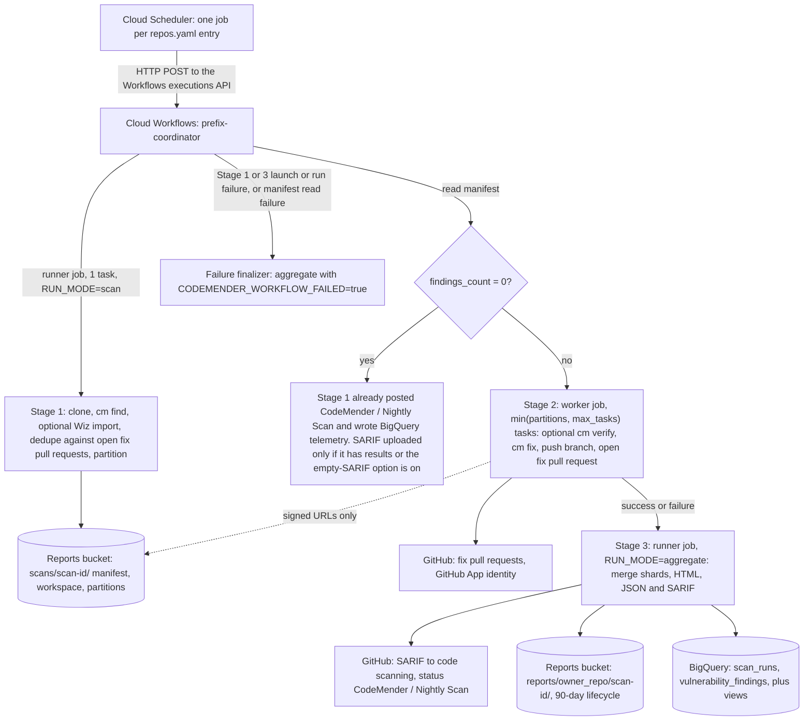
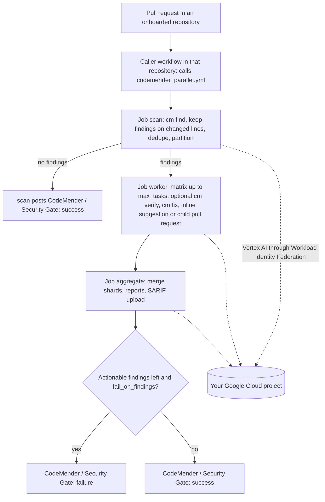
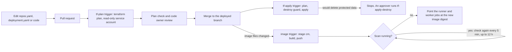

# How it works

This page describes the three flows, where the data lives, and the security
model. For setup, see the [GitOps guide](../guides/gitops_cloud_build.md) and
[Operations](operations.md).

`<prefix>` is `resource_prefix` from `deployment.yaml` (default `codemender`).

## Scheduled scans (Google Cloud)

This is the main flow. Each entry in `repos.yaml` becomes a Cloud Scheduler job
that starts the `<prefix>-coordinator` workflow on the entry's schedule. The
workflow runs the scan in three stages on two Cloud Run jobs.

Step by step:

1.  **Trigger.** The scheduler job posts the entry's settings (repository URL,
    scan directories, branch, build command, `max_tasks`, `skip_verify`, and
    any model, `cm` flag, dry-run or Wiz settings) to the workflow, as the
    `<prefix>-scheduler-sa` service account.
2.  **Stage 1: scan** (`<prefix>-runner`, one task).
    *   Clones the repository and runs `cm find`.
    *   If Wiz import is enabled for the entry, imports Wiz findings at or
        above `min_severity`. Imported findings are always verified with
        `cm verify` before they are fixed, even when `skip_verify` is true.
    *   Skips findings that already have an open fix pull request or branch.
    *   Splits the remaining findings into partitions, and uploads the
        workspace and partitions to the reports bucket with a manifest.
    *   If nothing is left, it posts the status, writes telemetry and stops
        here. No HTML report is produced for a clean scan.
3.  **Stage 2: fix** (`<prefix>-worker`, one task per partition, at most
    `max_tasks`).
    *   Each task downloads its partition through signed URLs, optionally runs
        `cm verify`, runs `cm fix`, and pushes a branch and opens a pull
        request against the scanned branch for each fixed finding.
    *   If some tasks fail, the workflow still runs Stage 3 so the completed
        results are published.
4.  **Stage 3: publish** (`<prefix>-runner`, one task).
    *   Merges the workers' results into HTML, JSON and SARIF reports.
    *   Uploads the SARIF to GitHub code scanning (when it has results) and
        posts the `CodeMender / Nightly Scan` status on the scanned commit.
    *   Writes the HTML report to the reports bucket and a row per scan and per
        finding to BigQuery.
5.  **Failures.** If Stage 1 or Stage 3 fails, or the manifest cannot be read,
    the workflow runs a short finalizer so the GitHub status does not stay
    pending and the failure is recorded, then fails the execution.

`CodeMender / Nightly Scan` is informational: its state is `success` whenever
the scan completes, and its description gives the number of active findings.
It is not meant to block merges.

The Cloud Run jobs have a 24-hour timeout per stage. A `--deep` scan
(`find_flags` in `repos.yaml`) can take several hours.

## Pull request scans (GitHub Actions)

This flow is optional. It scans the changes in each pull request, from GitHub
Actions in the repository itself, and reports only vulnerabilities that the
pull request introduces or touches.

How it fits together:

*   `.github/workflows/codemender_parallel.yml` in this repository is a
    reusable workflow. Each scanned repository adds a small caller workflow
    that decides when it runs (for example, on `pull_request`) and passes its
    inputs and secrets.
*   The jobs run in containers from a runner image that your organization
    hosts. Always set the `runner_image` input explicitly;
    `.github/workflows/build_runner_image.yml` can build and publish one.
*   The jobs reach Vertex AI in your project through Workload Identity
    Federation. `terraform/gha_wif/` creates the identity pool, a service
    account and the related repository secrets.
*   Intermediate files are passed between jobs as GitHub Actions artifacts. No
    Cloud Storage bucket is used.
*   The status check is `CodeMender / Security Gate`. It fails only when
    actionable findings are left on the pull request's changes and
    `fail_on_findings` is true (the default).
*   Wiz import is not used in this flow.

**Start in advisory mode.** A failing status only blocks merging if your
branch ruleset lists `CodeMender / Security Gate` as a required check. Roll it
out without making it required, or with `fail_on_findings: false`, and make it
blocking once teams are used to the results.

## GitOps deployment changes (Cloud Build)

Your platform team changes the deployment through pull requests to your copy
of this repository. Nobody runs Terraform by hand after the one-time bootstrap.

*   **Plan** runs on every pull request into the deployed branch, as the
    `<prefix>-tf-plan` service account, which can read but not change anything
    and cannot read secret values, BigQuery data or scan executions.
*   **Apply** runs on every push to the deployed branch, as
    `<prefix>-tf-apply`. It plans again, stops if the plan would delete or
    replace a bucket, BigQuery dataset or table, secret, or the image
    registry, and otherwise applies that plan.
*   **Image** runs when a merge changes the runner image or its rollout
    (`Dockerfile`, `codemender_agent/`, `orchestrator.py`, `requirements.txt`,
    `cloudbuild.yaml`, `scripts/ci/image_rollout.sh`). It downloads the pinned
    CodeMender CLI, builds and pushes the image, and waits until no scan is
    running before it switches both jobs to the new image.

The [GitOps guide](../guides/gitops_cloud_build.md) covers the bootstrap,
approvals, the destroy guard and manual rollback.

## Where data lives

| Data | Where | Retention |
| --- | --- | --- |
| Scan workspace, partitions, worker results, JSON and SARIF reports | Reports bucket, `scans/<scan-id>/` | Deleted after 90 days |
| HTML report | Reports bucket, `reports/<owner>_<repo>/<scan-id>/` | Deleted after 90 days |
| Scan history and findings | BigQuery dataset (`codemender_telemetry` by default) | Until you delete it |
| Findings | GitHub code scanning in each repository | GitHub's retention |
| Fixes | Branches and pull requests in each repository | Until closed or deleted |
| Logs | Cloud Logging for the jobs, the workflow and Cloud Build | Your Cloud Logging retention |
| Terraform state | `<prefix>-tfstate-<project>` bucket (versioned) | Kept |
| Pull request scan artifacts | GitHub Actions artifacts | 3 days (intermediate) and 90 days (reports) by default |

BigQuery does not store source code or the model's analysis text unless
`bigquery_include_snippets` is set to `true` in `deployment.yaml` (default
`false`).

## Security model

### Identities

| Service account | Used by | Can |
| --- | --- | --- |
| `<prefix>-scheduler-sa` | Cloud Scheduler | Start workflow executions |
| `<prefix>-workflows-sa` | The coordinator workflow | Run the two Cloud Run jobs with overrides, read Cloud Run state, read the reports bucket |
| `<prefix>-runner-sa` | Stages 1 and 3 | Read and write the reports bucket and sign URLs for it, use Vertex AI, read the GitHub App key, write its BigQuery dataset, read the Wiz credentials (if Wiz import is on) |
| `<prefix>-worker-sa` | Stage 2 | Use Vertex AI, read the GitHub App key. No access to the bucket (signed URLs only) and none to BigQuery |
| `<prefix>-tf-plan` | Pull request plans | Read-only; no secret values, BigQuery data, scan executions or objects outside the state bucket |
| `<prefix>-tf-apply` | Applies after merge | Manage everything the deployment creates, including project IAM |
| `<prefix>-image-build` | Image builds and rollouts | Push to the image registry and update the two Cloud Run jobs |

### GitHub access

*   The scheduled scans use a GitHub App that your organization creates and
    installs on the scanned repositories only. The jobs read the App's private
    key from Secret Manager and mint installation tokens scoped to the scanned
    repository. Tokens last one hour and are refreshed during long scans.
*   Pull requests, comments and statuses are attributed to the App's bot
    account.
*   The pull request flow authenticates with its own App credentials, stored as
    GitHub Actions secrets in the scanned repository.

### Secrets

*   Secrets are stored only in Secret Manager (or, for the pull request flow,
    GitHub Actions secrets). The YAML files only name them.
*   Terraform references the GitHub App key and Wiz secrets without managing
    them, so their values never enter Terraform state and a Terraform change
    cannot delete them.
*   Before it runs `cm`, the orchestrator removes GitHub tokens, the App key,
    Wiz credentials and service account key variables from the environment.

### Code execution

*   `cm` builds and tests the scanned code, and runs the repository's
    `build_command`. That code runs inside the Cloud Run job with the job's
    service account, which can reach Vertex AI and read the GitHub App key.
    Only onboard repositories you trust, and require code owner review for
    `repos.yaml`.
*   On Cloud Run, the CodeMender CLI's own sandbox is turned off
    (`CODEMENDER_SANDBOX_ENABLED=false` on both jobs). The jobs rely on Cloud
    Run's container isolation, and each execution starts from a fresh
    container.
*   In the GitHub Actions pull request flow, the sandbox is on by default
    (`sandbox_enabled`), and the jobs run in privileged containers, which the
    sandbox needs.

### Deployment changes

*   A pull request's build file cannot change which service account runs it:
    Cloud Build always runs a trigger's builds as the trigger's own account.
*   The plan account can read Terraform state, which can contain sensitive
    values. Treat pull request access to your copy as access to the state.
*   The apply account can grant project IAM roles. Protect the deployed branch
    so that every change goes through a reviewed pull request.

### Not provided

*   No Cloud Monitoring alert policies are created.
*   A clean scheduled scan does not clear existing code scanning alerts (see
    [Where results show up](README.md#where-results-show-up)).
