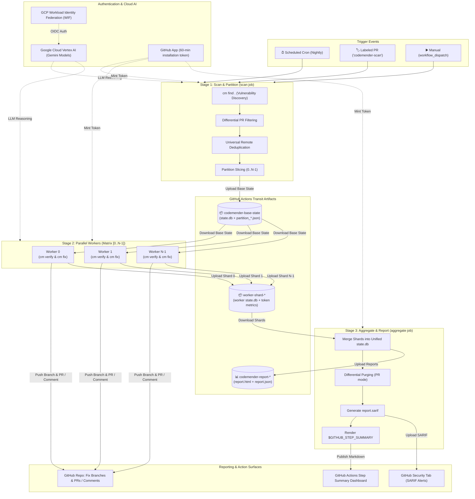

# CodeMender GitHub Actions Orchestrator Guide

This guide provides step-by-step instructions for onboarding repositories to
**CodeMender Orchestrator** using native **GitHub Actions (GHA)** workflows.

CodeMender runs as a decentralized, 3-stage parallel pipeline inside
containerized GitHub Actions runners, enabling automated vulnerability scanning,
exploit verification, and patch synthesis with **zero external cloud storage
buckets or dedicated compute infrastructure required** (requiring only Vertex AI
API access for AI model reasoning).

--------------------------------------------------------------------------------

## 1. Architecture Overview

CodeMender Orchestrator in GitHub Actions operates as a decentralized, 3-stage
parallel scanning and automated remediation pipeline running completely within
containerized GitHub Actions runners without requiring external cloud storage
buckets or dedicated compute infrastructure:

*   **Universal Container Runner (`codemender-runner`)**: Pre-baked container
    image (`ghcr.io/ilbzzz/codemender-runner:latest` or custom BYOI) containing
    multi-language toolchains (Node.js, Python, Java, Go), build essentials, and
    the `cm` binary in `/usr/local/bin/cm`.
*   **Stage 1: Scan & Partitioning Job (`scan`)**: Ephemeral container job that
    discovers vulnerabilities (`cm find .`), executes differential PR filtering,
    deduplicates against existing branches, slices findings into $N$ worker
    partitions, and uploads the base workspace state.
*   **Stage 2: Parallel Remediation Matrix (`worker`)**: Dynamic parallel matrix
    of container jobs that download the base state, verify exploitability (`cm
    verify`), synthesize patches (`cm fix`), stage edits surgically, push fix
    branches, and open Pull Requests.
*   **Stage 3: Aggregation & Reporting (`aggregate`)**: Merges all worker shard
    databases into a single unified `state.db`, purges ignored findings for PRs,
    generates SARIF reports for the GitHub Security Tab, renders Step Summaries,
    and uploads downloadable HTML/JSON triage reports.
*   **GitHub Transit Artifacts Storage**: Native GitHub Actions artifact storage
    used to pass intermediate states (`codemender-base-state`, `worker-shard-*`)
    and final reports between stages with zero external infrastructure costs.
*   **Authentication & Credential Minting**:
    *   **Google Cloud Vertex AI**: Keyless OIDC authentication via Workload
        Identity Federation (WIF) for Gemini LLM reasoning.
    *   **GitHub REST & Git**: Ephemeral 60-minute tokens minted via GitHub App
        for secure branch creation, PR opening, and SARIF uploads.

### Execution Scope: Isolated Runners vs. Transit Storage

*   **Shared Transit Storage (Run Scope)**:
    *   `codemender-base-state`: Base workspace database and partition slices
        (retained for 3 days by default).
    *   `worker-shard-<index>`: Individual worker database shards and token
        metrics.
    *   `codemender-report-html`, `codemender-report-json`: Downloadable scan
        reports (retained for 90 days).
*   **Isolated Workspace (Per Runner Job)**:
    *   Each matrix task executes in its own isolated container filesystem with
        its own checked-out repository and ephemeral environment.
    *   The `cm` sandbox isolates child process execution (e.g. `npm test`,
        `pytest`) using process namespaces and mount isolation.



--------------------------------------------------------------------------------

## 2. Scanning Execution Modes: Scheduled Nightly vs. Pull Request Scans

CodeMender provides tailored execution behaviors depending on whether the scan
is triggered on a recurring schedule or against an active Pull Request:

### Execution Modes Comparison

| Feature | Scheduled Nightly Scan | Internal Pull Request Scan | Fork Pull Request Scan |
| :--- | :--- | :--- | :--- |
| **Trigger Event** | `schedule` (cron) / `workflow_dispatch` | `pull_request` (`types: [labeled]`) | `pull_request` (`types: [labeled]`) |
| **Activation Condition** | Cron triggers on default branch | `codemender-scan` label on PR | `codemender-scan` label on PR |
| **Target Base Ref** | Default branch (`main` / `master`) | PR Base branch (e.g. `main`) | PR Base branch |
| **Scan Scope** | Entire repository (`cm find .`) | Differential: PR changed lines only | Differential: PR changed lines only |
| **Legacy Tech Debt** | Discovered & triaged | Marked `PRE_EXISTING_IGNORED` & suppressed | Marked `PRE_EXISTING_IGNORED` & suppressed |
| **Duplicate Handling** | Marked `SKIPPED_DUPLICATE` (kept in SARIF as `underReview`) | Skipped if fix branch/PR exists | Skipped if fix branch/PR exists |
| **Remediation Action** | Pushes `codemender/fix-...` & opens PR to `main` | Pushes `codemender/fix-...` & opens Child PR to developer branch | Posts Markdown review comment with diff on Fork PR |
| **Reporting Output** | Full SARIF alert inventory, HTML, JSON, Step Summary | PR-scoped SARIF, Child PR, Step Summary | PR-scoped SARIF, PR Review Comment, Step Summary |

--------------------------------------------------------------------------------

### Mode A: Scheduled (Nightly) Scans

Scheduled scans run on a recurring timer (e.g. weekly on Sunday or nightly at
2:00 AM UTC) to audit the entire repository, maintain security alert
inventories, and remediate technical debt.

1.  **Triggering**: Configured via `schedule.cron` in
    `.github/workflows/codemender.yml` (or on-demand via `workflow_dispatch`).
2.  **Full Repository Scanning & Deduplication**: Discovers all vulnerabilities
    across the entire codebase (`cm find .`), deduplicating against existing
    remote branches and open PRs (`SKIPPED_DUPLICATE`).
3.  **Worker Remediation & Mainline PRs**: Verifies findings (`cm verify`),
    synthesizes patches (`cm fix`), and opens **Pull Requests targeting the
    default branch (`main`)**.
4.  **Final Outputs & Security Tab Inventory**: Uploads complete `report.sarif`
    to the GitHub Security Tab (tagging duplicate findings with `underReview`
    suppression metadata), renders `$GITHUB_STEP_SUMMARY`, and saves
    downloadable HTML/JSON triage reports.

--------------------------------------------------------------------------------

### Mode B: Pull Request Scans ("Clean as You Code")

Pull Request scans ensure that no new security vulnerabilities are merged into
the codebase, while preventing legacy repository debt from blocking developer
pull requests.

1.  **Triggering & Labeling (`types: [labeled]`)**:
    *   Activates on `pull_request` events when the **`codemender-scan`** label
        is attached.
    *   **Zero Noise**: Using `types: [labeled]` avoids spawning 1-second
        "Skipped" runs when regular PRs are opened or pushed to.
2.  **Differential PR Scanning**:
    *   Calculates merge-base diff hunks (`git diff -U0 origin/<base>...HEAD`)
        to isolate modified lines.
    *   **Pre-Existing Tech Debt Suppression**: Findings outside modified lines
        are marked `PRE_EXISTING_IGNORED` and excluded from worker tasks and PR
        reports.
3.  **Worker Remediation Routing**:
    *   **Internal PRs**: Opens a **Child Pull Request targeting the developer's
        feature branch (`pr_head_ref`)**, allowing 1-click merging into the PR.
    *   **Fork PRs**: Respects fork security boundaries by posting an inline
        **Markdown Review Comment** on the PR with exploit analysis, unified
        patch diff, and `git apply` commands.
4.  **Final Outputs**:
    *   Purges `PRE_EXISTING_IGNORED` records so PR status checks and SARIF
        annotations strictly reflect vulnerabilities on the PR diff.
    *   Enforces a blocking Quality Gate (`fail_on_findings: true`) if
        unresolved vulnerabilities remain on the PR diff.

--------------------------------------------------------------------------------

## 3. Authentication & Prerequisites Setup

To run CodeMender in GitHub Actions, configure the following two authentication
components:

1.  **Google Cloud Platform (GCP) Credentials**: Used to authenticate with
    Vertex AI / Gemini LLM APIs for exploit verification and patch generation.
    *   Recommended: **Workload Identity Federation (WIF)** (keyless OIDC
        authentication).
    *   Alternative: **Service Account Key JSON** (`GCP_SA_KEY`).
2.  **GitHub Authentication Token**:
    *   Recommended: **GitHub App** (auto-generates 60-minute installation
        tokens with granular permissions).
    *   Alternative: Standard `GITHUB_TOKEN` or Personal Access Token (PAT).

--------------------------------------------------------------------------------

### Step 1: Setting Up GCP Workload Identity Federation (WIF)

Workload Identity Federation allows GitHub Actions to securely call Google Cloud
Vertex AI without managing long-lived service account key JSONs.

#### 1. Create the Workload Identity Pool & Service Account

```bash
# 1. Base configuration variables
PROJECT_ID="your-gcp-project-id"
PROJECT_NUMBER=$(gcloud projects describe "$PROJECT_ID" --format='value(projectNumber)')
POOL_NAME="github-actions-pool"
PROVIDER_NAME="github-actions-provider"
SA_NAME="codemender-runner-sa"
SA_EMAIL="${SA_NAME}@${PROJECT_ID}.iam.gserviceaccount.com"

# 2. Create the Workload Identity Pool
gcloud iam workload-identity-pools create "$POOL_NAME" \
    --project="$PROJECT_ID" \
    --location="global" \
    --display-name="GitHub Actions Pool"

# 3. Create the dedicated service account
gcloud iam service-accounts create "$SA_NAME" \
    --project="$PROJECT_ID" \
    --display-name="CodeMender Runner Service Account"

# 4. Grant Vertex AI User role for LLM inference
gcloud projects add-iam-policy-binding "$PROJECT_ID" \
    --member="serviceAccount:${SA_EMAIL}" \
    --role="roles/aiplatform.user"
```

#### 2. Configure Provider & IAM Binding by Scope

Choose the scoping model that matches your setup:

*   **Option A: User Scope (All Repos under a Personal Account)**:

    ```bash
    GITHUB_USER="your-github-username"

    gcloud iam workload-identity-pools providers create-oidc "$PROVIDER_NAME" \
        --project="$PROJECT_ID" \
        --location="global" \
        --workload-identity-pool="$POOL_NAME" \
        --display-name="GitHub User Provider" \
        --attribute-mapping="google.subject=assertion.sub,attribute.actor=assertion.actor,attribute.repository=assertion.repository,attribute.repository_owner=assertion.repository_owner" \
        --attribute-condition="assertion.repository_owner == '$GITHUB_USER'" \
        --issuer-uri="https://token.actions.githubusercontent.com"

    gcloud iam service-accounts add-iam-policy-binding "$SA_EMAIL" \
        --project="$PROJECT_ID" \
        --role="roles/iam.workloadIdentityUser" \
        --member="principalSet://iam.googleapis.com/projects/${PROJECT_NUMBER}/locations/global/workloadIdentityPools/${POOL_NAME}/attribute.repository_owner/${GITHUB_USER}"
    ```

*   **Option B: Organization Scope (All Repos under an Organization)**:

    ```bash
    GITHUB_ORG="your-github-org"

    gcloud iam workload-identity-pools providers create-oidc "$PROVIDER_NAME" \
        --project="$PROJECT_ID" \
        --location="global" \
        --workload-identity-pool="$POOL_NAME" \
        --display-name="GitHub Org Provider" \
        --attribute-mapping="google.subject=assertion.sub,attribute.actor=assertion.actor,attribute.repository=assertion.repository,attribute.repository_owner=assertion.repository_owner" \
        --attribute-condition="assertion.repository_owner == '$GITHUB_ORG'" \
        --issuer-uri="https://token.actions.githubusercontent.com"

    gcloud iam service-accounts add-iam-policy-binding "$SA_EMAIL" \
        --project="$PROJECT_ID" \
        --role="roles/iam.workloadIdentityUser" \
        --member="principalSet://iam.googleapis.com/projects/${PROJECT_NUMBER}/locations/global/workloadIdentityPools/${POOL_NAME}/attribute.repository_owner/${GITHUB_ORG}"
    ```

*   **Option C: Specific List of Named Repositories**:

    ```bash
    gcloud iam workload-identity-pools providers create-oidc "$PROVIDER_NAME" \
        --project="$PROJECT_ID" \
        --location="global" \
        --workload-identity-pool="$POOL_NAME" \
        --display-name="GitHub Specific Repos Provider" \
        --attribute-mapping="google.subject=assertion.sub,attribute.actor=assertion.actor,attribute.repository=assertion.repository" \
        --attribute-condition="assertion.repository in ['your-org/repo-a', 'your-org/repo-b']" \
        --issuer-uri="https://token.actions.githubusercontent.com"

    ALLOWED_REPOS=("your-org/repo-a" "your-org/repo-b")
    for REPO in "${ALLOWED_REPOS[@]}"; do
        gcloud iam service-accounts add-iam-policy-binding "$SA_EMAIL" \
            --project="$PROJECT_ID" \
            --role="roles/iam.workloadIdentityUser" \
            --member="principalSet://iam.googleapis.com/projects/${PROJECT_NUMBER}/locations/global/workloadIdentityPools/${POOL_NAME}/attribute.repository/${REPO}"
    done
    ```

--------------------------------------------------------------------------------

### Step 2: GitHub App Setup & Permissions

Creating a dedicated GitHub App ensures that tokens are minted with
least-privilege permissions and that automated commits/PRs are attributed
cleanly to the bot.

#### 1. Required Permissions

When creating your GitHub App in **Settings $\rightarrow$ Developer settings
$\rightarrow$ GitHub Apps**:

*   **Repository Permissions**:
    *   `Contents: Read and write` (to checkout code and push remediation
        branches)
    *   `Pull requests: Read and write` (to open Child PRs and post review
        comments)
    *   `Commit statuses: Read and write` (to post dedicated 'CodeMender /
        Security Gate' status checks on PRs)
    *   `Code scanning alerts: Read and write` (maps to `security-events: write`
        in workflow YAML to upload SARIF reports to GitHub Security Tab)
    *   `Issues: Read and write` (for review comments on Fork PRs)

#### 2. App Credentials to Save

*   **App ID**: Numeric ID shown on the App settings page (maps to secret
    `GH_APP_ID`).
*   **Private Key**: Generate and download a `.pem` private key (maps to secret
    `GH_APP_PRIVATE_KEY`).

--------------------------------------------------------------------------------

## 4. Enabling CodeMender in Target Repositories (4-Step Onboarding Checklist)

To enable CodeMender security scanning and automated remediation on any target
repository (e.g. `your-org/backend-service` or `username/juice-shop-local`),
follow this 4-step onboarding checklist.

### Understanding the Containerized Runner Model

CodeMender runs as a containerized pipeline inside GitHub Actions:

*   The reusable workflow executes inside the pre-built CodeMender base runner
    image (`ghcr.io/ilbzzz/codemender-runner:latest` or your organization's
    runner).
*   The container contains pre-baked multi-language toolchains (Python 3.11,
    Node.js 20 LTS, Java 17, Go 1.22+), build essentials (`gcc`, `make`, `curl`,
    `git`), and the `cm` Go binary in `/usr/local/bin/cm`.
*   Target repositories only need to configure authentication secrets and add a
    caller workflow file (`.github/workflows/codemender.yml`).

--------------------------------------------------------------------------------

### Step 1: Install the GitHub App on the Target Repository

1.  Navigate to your GitHub App settings or installation dashboard:
    *   **Personal Account**:
        `https://github.com/settings/apps/<your-app-name>/installations`
    *   **Organization**:
        `https://github.com/organizations/<your-org>/settings/apps/<your-app-name>/installations`
2.  Click **Configure** next to the installation entry.
3.  Under **Repository access**, select **All repositories** (recommended for
    org-wide coverage) or **Only select repositories** (e.g.
    `juice-shop-local`).
4.  Click **Save**.

--------------------------------------------------------------------------------

### Step 2: Configure Actions Secrets

Add the required credentials so the runner can authenticate with GCP Vertex AI
(Gemini LLM APIs) and GitHub:

#### Option A: Organization-Level Secrets (Recommended for Organizations)

Configure once at **Organization Settings $\rightarrow$ Secrets and variables
$\rightarrow$ Actions**:

*   `GCP_WORKLOAD_IDENTITY_PROVIDER`
*   `GCP_SERVICE_ACCOUNT`
*   `GH_APP_ID`
*   `GH_APP_PRIVATE_KEY`

#### Option B: Repository-Level Secrets (Personal Accounts or Individual Repos)

In your target repository, navigate to **Settings $\rightarrow$ Secrets and
variables $\rightarrow$ Actions** and add:

*   `GCP_WORKLOAD_IDENTITY_PROVIDER`: e.g.
    `projects/123456789/locations/global/workloadIdentityPools/github-actions-pool/providers/github-actions-provider`
*   `GCP_SERVICE_ACCOUNT`: e.g.
    `codemender-runner-sa@your-gcp-project.iam.gserviceaccount.com`
*   `GH_APP_ID`: Application ID of your GitHub App
*   `GH_APP_PRIVATE_KEY`: Complete PEM content of the private key (`-----BEGIN
    RSA PRIVATE KEY...`)

> [!IMPORTANT]
> **Verify GCP WIF Scoping**: Ensure the target repository is
> covered by your Workload Identity Provider's attribute conditions (Section 3).

--------------------------------------------------------------------------------

### Step 3: Grant GHCR Package Access to Target Repository

GitHub Actions runners need permission to pull the runner container image
(`ghcr.io/ilbzzz/codemender-runner:latest`).

*   **Public Package**: No package access configuration needed. Any target
    repository can pull the runner image immediately.
*   **Private Package**:
    1.  Go to your GitHub profile or organization $\rightarrow$ **Packages** tab
        $\rightarrow$ select **`codemender-runner`**.
    2.  Click **Package settings** (sidebar) $\rightarrow$ scroll to **Manage
        Actions access**.
    3.  Click **Add repository** $\rightarrow$ select your target repository
        $\rightarrow$ select role **Read**.
    4.  In your caller workflow, ensure the top-level permissions block contains
        `packages: read`.

--------------------------------------------------------------------------------

### Step 4: Add Caller Workflow (`.github/workflows/codemender.yml`)

Add a workflow file at `.github/workflows/codemender.yml` on your default
branch:

*   **Standard Setup**: Copy the ready-to-use production caller workflow from
    [Section 5 (Example 1)](#example-1-production-standard-workflow-scheduled--pull-request-ci).
*   **Personal Accounts with Private Repositories**: GitHub disallows
    cross-repository reusable workflow calls between private repositories under
    personal accounts. Copy `codemender_parallel.yml` into `.github/workflows/`
    of the target repository and call it locally:

    ```yaml
        uses: ./.github/workflows/codemender_parallel.yml
    ```

--------------------------------------------------------------------------------

## 5. Example Caller Workflows

Create a workflow file in your repository at `.github/workflows/codemender.yml`.

> [!IMPORTANT]
> **Understanding `${{ inputs.* }}` vs. Fallback Defaults (`||`)**:
> In GitHub Actions, the `${{ inputs.* }}` context is **ONLY populated during
> manual `workflow_dispatch` executions**. When scans are triggered
> automatically by a **Pull Request** (`pull_request`) or a **Scheduled Nightly
> cron job** (`schedule`), `${{ inputs.* }}` evaluates to `null` / empty.
>
> Therefore, **the vast majority of your CI/CD scans will execute using the
> Fallback Default value** defined on the right-hand side of the `||` operator
> (e.g. `${{ inputs.fix_model || 'gemini-2.5-flash' }}` or `${{
> inputs.build_command || 'npm test' }}`).
>
> **Rule of Thumb**: Always set your repository's desired build commands, target
> paths, and model overrides as the **fallback default value** so they apply
> automatically to all PR and Nightly runs!

### Example 1: Production Standard Workflow (Scheduled & Pull Request CI)

This is the recommended turnkey configuration for standard web and backend
repositories:

```yaml
name: CodeMender Security Remediation

on:
  # ---------------------------------------------------------------------------
  # 1. Scheduled Recurring Audit (Full Repository Sweeps)
  # ---------------------------------------------------------------------------
  schedule:
    # Runs weekly on Sunday at 2:00 AM UTC.
    # Cron format: minute (0-59) hour (0-23) day-of-month (1-31) month (1-12) day-of-week (0-6, 0=Sunday)
    # Examples:
    #   - '0 2 * * 0'  -> Weekly on Sunday at 02:00 UTC
    #   - '0 2 * * *'  -> Nightly every day at 02:00 UTC
    - cron: '0 2 * * 0'

  # ---------------------------------------------------------------------------
  # 2. Pull Request Scanning ("Clean as You Code")
  # ---------------------------------------------------------------------------
  pull_request:
    # Trigger ONLY when the 'codemender-scan' label is added to a PR.
    # Note: 'types: [labeled]' prevents generating 1-second skipped runs on untagged PRs.
    # To also auto-scan whenever new commits are pushed to an already-labeled PR, use:
    #   types: [labeled, synchronize]
    types: [labeled]

    # Target base branches to guard (e.g. main, master, release/*)
    branches: [main, master]

  # ---------------------------------------------------------------------------
  # 3. Manual On-Demand Trigger (GitHub UI / gh CLI)
  # ---------------------------------------------------------------------------
  workflow_dispatch:

# -----------------------------------------------------------------------------
# GitHub Actions Permissions (Required by CodeMender Multi-Stage Pipeline)
# -----------------------------------------------------------------------------
permissions:
  id-token: write         # Required: GCP Workload Identity Federation (WIF) OIDC authentication
  contents: write         # Required: Pushing automated 'codemender/fix-...' git branches
  pull-requests: write    # Required: Opening Child Pull Requests or posting review comments
  security-events: write  # Required: Uploading SARIF reports to GitHub Code Scanning (Security Tab)
  actions: read           # Required: Passing intermediate state artifacts between runner jobs
  packages: read          # Required: Pulling runner container image from GitHub Container Registry (GHCR)

jobs:
  remediate:
    # Execution Guard: Run on Schedule, Manual Dispatch, or PRs with 'codemender-scan' label
    if: >
      github.event_name == 'schedule' ||
      github.event_name == 'workflow_dispatch' ||
      (github.event_name == 'pull_request' && contains(github.event.pull_request.labels.*.name, 'codemender-scan'))

    # Call the reusable CodeMender orchestration workflow
    uses: ilbzzz/codemender-agent/.github/workflows/codemender_parallel.yml@main

    with:
      # --- Build & Test Verification (CRITICAL) ---
      # Command executed by 'cm fix' to ensure generated patches build and pass unit tests.
      # Leave empty ('') to auto-detect based on package.json, pom.xml, requirements.txt, etc.
      # Examples:
      #   - Node.js / TypeScript: 'npm test' or 'npm run test:ci' or 'yarn test'
      #   - Python:               'pytest' or 'python -m unittest discover tests'
      #   - Java / Maven:         'mvn clean test'
      #   - Java / Gradle:        './gradlew test'
      #   - Go:                   'go test ./...'
      #   - Rust:                 'cargo test'
      build_command: 'npm test'

    secrets:
      # --- Google Cloud Platform Authentication (Keyless Workload Identity Federation) ---
      gcp_workload_identity_provider: ${{ secrets.GCP_WORKLOAD_IDENTITY_PROVIDER }}
      gcp_service_account: ${{ secrets.GCP_SERVICE_ACCOUNT }}

      # --- GitHub Authentication (GitHub App Bot) ---
      github_app_id: ${{ secrets.GH_APP_ID }}
      github_app_private_key: ${{ secrets.GH_APP_PRIVATE_KEY }}
```

--------------------------------------------------------------------------------

### Example 2: In-Depth Custom Configuration (All Available Inputs & Interactive UI)

This example demonstrates how to expose all configurable parameters as
interactive UI inputs for `workflow_dispatch`, and documents every single
available workflow input, secret option, and runtime toggle:

```yaml
name: CodeMender Security Remediation (Custom & Interactive)

on:
  schedule:
    - cron: '0 2 * * 0'  # Weekly on Sunday at 2:00 AM UTC
  pull_request:
    types: [labeled, synchronize]  # Triggers on label AND on new commits pushed to labeled PR
    branches: [main, master]
  workflow_dispatch:
    # Interactive UI inputs shown when manually clicking "Run workflow" in GitHub UI
    inputs:
      scan_target:
        description: 'Target subdirectory path(s) to scan (default: . for repository root)'
        required: false
        default: '.'
        type: string
      build_command:
        description: 'Custom build & test verification command (e.g. npm test, pytest, mvn test)'
        required: false
        default: 'npm test'
        type: string
      max_tasks:
        description: 'Maximum number of parallel worker tasks (Stage 2 concurrency)'
        required: false
        default: '6'
        type: string
      skip_exploit_verification:
        description: 'Skip dynamic exploit verification (cm verify --skip-exploit-verification)'
        required: false
        default: false
        type: boolean
      model:
        description: 'Default Gemini model across all stages (leave empty for CodeMender default)'
        required: false
        default: ''
        type: string
      find_model:
        description: 'Dedicated model override for Stage 1 discovery (cm find)'
        required: false
        default: ''
        type: string
      verify_model:
        description: 'Dedicated model override for Stage 2 verification (cm verify)'
        required: false
        default: ''
        type: string
      fix_model:
        description: 'Dedicated model override for Stage 2 patch synthesis (cm fix)'
        required: false
        default: ''
        type: string

permissions:
  id-token: write         # Required: GCP Workload Identity Federation (WIF) OIDC token exchange
  contents: write         # Required: Creating 'codemender/fix-...' branches and pushing fixes
  pull-requests: write    # Required: Opening automated Child PRs and posting review comments
  security-events: write  # Required: Uploading SARIF alerts to GitHub Code Scanning
  actions: read           # Required: Transit state artifact management between runner jobs
  packages: read          # Required: Pulling container image from GitHub Container Registry (GHCR)

jobs:
  remediate:
    if: >
      github.event_name == 'schedule' ||
      github.event_name == 'workflow_dispatch' ||
      (github.event_name == 'pull_request' && contains(github.event.pull_request.labels.*.name, 'codemender-scan'))

    uses: ilbzzz/codemender-agent/.github/workflows/codemender_parallel.yml@main

    with:
      # =======================================================================
      # 1. RUNNER & INFRASTRUCTURE CONFIGURATION (OPTIONAL)
      # =======================================================================
      # Optional: Specify a Bring-Your-Own-Image (BYOI) if your build requires specialized toolchains.
      # Default: 'ghcr.io/ilbzzz/codemender-runner:latest'
      runner_image: 'ghcr.io/ilbzzz/codemender-runner:latest'

      # Optional: Custom runner sizing (e.g. 'ubuntu-latest-8-cores') or self-hosted runner labels.
      # Default: 'ubuntu-latest'
      runner_type: 'ubuntu-latest'

      # =======================================================================
      # 2. SCAN SCOPE & BUILD VALIDATION
      # =======================================================================
      # Subdirectory path(s) to scan. Semicolon-separated paths are supported.
      # ⚠️ Fallback Default ('.'): Used on all automated PR and Nightly scans (since inputs.scan_target is null).
      scan_target: ${{ inputs.scan_target || '.' }}

      # Custom build/test command executed by 'cm fix' to validate code patches.
      # ⚠️ Fallback Default ('npm test'): Set your repo's build/test command here so it runs on PR scans!
      # Examples: 'npm test', 'pytest', 'mvn test', 'go test ./...', 'cargo test'
      build_command: ${{ inputs.build_command || 'npm test' }}

      # Optional: Skip dynamic exploit verification during Stage 2 (cm verify --skip-exploit-verification).
      # ⚠️ Fallback Default (false): Generates & verifies PoC exploits dynamically before synthesis.
      skip_exploit_verification: ${{ inputs.skip_exploit_verification || false }}

      # =======================================================================
      # 3. PARALLELISM & CONCURRENCY
      # =======================================================================
      # Maximum number of parallel worker tasks in Stage 2.
      # ⚠️ Fallback Default (6): Sets concurrency for automated PR scans and Nightly runs.
      max_tasks: ${{ inputs.max_tasks && fromJson(inputs.max_tasks) || 6 }}

      # =======================================================================
      # 4. AI MODEL CONFIGURATION (OPTIONAL)
      # =======================================================================
      # ⚠️ Fallback Defaults: During automated PR and Nightly scans, inputs.* is null.
      # If you want a specific model used on PR scans, specify it as the fallback value after '||'.
      # Leave empty ('') to use CodeMender's up-to-date default Gemini models.
      # Consult documentation for latest supported models:
      # https://docs.cloud.google.com/gemini-enterprise-agent-platform/codemender#specifying-the-model
      model: ${{ inputs.model || '' }}               # Global model override across all stages
      find_model: ${{ inputs.find_model || '' }}     # Dedicated model for Stage 1 discovery (cm find)
      verify_model: ${{ inputs.verify_model || '' }} # Dedicated model for Stage 2 exploit verification (cm verify)
      fix_model: ${{ inputs.fix_model || '' }}       # Dedicated model for Stage 2 patch synthesis (cm fix, e.g. 'gemini-2.5-flash')

    secrets:
      # =======================================================================
      # 5. GCP AUTHENTICATION (CHOOSE WIF OR STATIC SA KEY)
      # =======================================================================
      # Option A: Workload Identity Federation (WIF) - RECOMMENDED (Keyless)
      gcp_workload_identity_provider: ${{ secrets.GCP_WORKLOAD_IDENTITY_PROVIDER }}
      gcp_service_account: ${{ secrets.GCP_SERVICE_ACCOUNT }}

      # Option B: Static GCP Service Account JSON Key (Alternative if WIF is not configured)
      # gcp_sa_key: ${{ secrets.GCP_SA_KEY }}

      # =======================================================================
      # 6. GITHUB AUTHENTICATION (CHOOSE GITHUB APP OR CUSTOM PAT)
      # =======================================================================
      # Option A: GitHub App Credentials - RECOMMENDED (Bypasses branch protection & posts as bot)
      github_app_id: ${{ secrets.GH_APP_ID }}
      github_app_private_key: ${{ secrets.GH_APP_PRIVATE_KEY }}

      # Option B: Custom Personal Access Token (Alternative if GitHub App is not configured)
      # custom_github_token: ${{ secrets.CUSTOM_GITHUB_TOKEN }}
```

--------------------------------------------------------------------------------

### Example 3: Monorepo / Multi-Target Scanning Workflow

If your repository contains multiple independent applications or services (e.g.
a Python backend and a TypeScript frontend in a single repository), you can
configure dedicated scan jobs with tailored build and test verification
commands:

```yaml
name: CodeMender Monorepo Security Remediation

on:
  schedule:
    - cron: '0 2 * * 0'  # Weekly on Sunday at 2:00 AM UTC
  pull_request:
    types: [labeled]
    branches: [main, master]
  workflow_dispatch:

permissions:
  id-token: write
  contents: write
  pull-requests: write
  security-events: write
  actions: read
  packages: read

jobs:
  # --- Job 1: Python Backend Service ---
  scan-backend:
    if: >
      github.event_name == 'schedule' ||
      github.event_name == 'workflow_dispatch' ||
      (github.event_name == 'pull_request' && contains(github.event.pull_request.labels.*.name, 'codemender-scan'))
    uses: ilbzzz/codemender-agent/.github/workflows/codemender_parallel.yml@main
    with:
      scan_target: 'services/backend'
      build_command: 'pytest services/backend/tests'
      max_tasks: 4
    secrets:
      gcp_workload_identity_provider: ${{ secrets.GCP_WORKLOAD_IDENTITY_PROVIDER }}
      gcp_service_account: ${{ secrets.GCP_SERVICE_ACCOUNT }}
      github_app_id: ${{ secrets.GH_APP_ID }}
      github_app_private_key: ${{ secrets.GH_APP_PRIVATE_KEY }}

  # --- Job 2: TypeScript Frontend Service ---
  scan-frontend:
    if: >
      github.event_name == 'schedule' ||
      github.event_name == 'workflow_dispatch' ||
      (github.event_name == 'pull_request' && contains(github.event.pull_request.labels.*.name, 'codemender-scan'))
    uses: ilbzzz/codemender-agent/.github/workflows/codemender_parallel.yml@main
    with:
      scan_target: 'services/frontend'
      build_command: 'npm test --prefix services/frontend'
      max_tasks: 4
    secrets:
      gcp_workload_identity_provider: ${{ secrets.GCP_WORKLOAD_IDENTITY_PROVIDER }}
      gcp_service_account: ${{ secrets.GCP_SERVICE_ACCOUNT }}
      github_app_id: ${{ secrets.GH_APP_ID }}
      github_app_private_key: ${{ secrets.GH_APP_PRIVATE_KEY }}
```

--------------------------------------------------------------------------------

### Manually Triggering On-Demand Scans

Once `.github/workflows/codemender.yml` is committed to your repository's
default branch (`main` or `master`), you can manually trigger security scans at
any time.

#### Option A: Via GitHub Web UI

1.  Go to your target repository on GitHub $\rightarrow$ **Actions** tab.
2.  In the left sidebar under *Workflows*, select **CodeMender Security
    Remediation**.
3.  Click the **Run workflow** dropdown on the right, select branch, configure
    optional inputs, and click **Run workflow**.

#### Option B: Via GitHub CLI (`gh`)

```bash
# Trigger scan on the default branch
gh workflow run codemender.yml

# Trigger scan on a specific branch with custom inputs
gh workflow run codemender.yml --ref main -f scan_target="." -f max_tasks="10"
```

--------------------------------------------------------------------------------

## 6. Building & Publishing the Standard Runner Base Image

The CodeMender runner base image (`ghcr.io/<org>/codemender-runner:latest`)
contains the pre-baked standard LTS language runtimes (Python 3.11, Node.js 20
LTS, Go 1.22+, OpenJDK 17), build essentials (`gcc`, `g++`, `make`, `git`,
`curl`, `fuser`, `unzip`), the `cm` Go binary in `/usr/local/bin/cm`, and the
isolated orchestrator Python virtual environment in `/opt/codemender/venv`.

### Method A: Automated CI Workflow (Recommended)

The repository includes a ready-to-use GitHub Actions workflow at
`.github/workflows/build_runner_image.yml` that builds and publishes the image
automatically:

1.  **Automatic Build**: Runs automatically whenever `Dockerfile`,
    `codemender_agent/**`, or `requirements.txt` are pushed to `main`.
2.  **Manual Dispatch**: Run manually via **Actions $\rightarrow$ Build &
    Publish CodeMender Runner Image $\rightarrow$ Run workflow**.

### Method B: Manual Local Build & Push via Docker CLI

```bash
# 1. Download the CodeMender Go CLI binary into the repository root
URL="https://artifactregistry.googleapis.com/download/v1/projects/cmoc-prod/locations/us/repositories/codemender-cli-production/files/cm%3Astable%3Acm-linux-amd64.zip:download?alt=media"
curl -fsSL -o cm-linux-amd64.zip "$URL"
unzip -q -o cm-linux-amd64.zip cm
chmod +x cm

# 2. Log in to GitHub Container Registry (GHCR) with 'write:packages' PAT
echo "$GITHUB_PAT" | docker login ghcr.io -u "your-github-username" --password-stdin

# 3. Build and push the base image
IMAGE_NAME="ghcr.io/your-org-or-username/codemender-runner:latest"
docker build -t "$IMAGE_NAME" .
docker push "$IMAGE_NAME"
```

> [!TIP]
> **Package Permissions**: Ensure target repositories have read access to
> your published package as described in
> [Section 4, Step 3](#step-3-grant-ghcr-package-access-to-target-repository).

--------------------------------------------------------------------------------

## 7. Bring-Your-Own-Image (BYOI) Custom Toolchains

If your repository requires specialized build tools (such as Rust, PHP, C++,
custom SDKs, or database engines for unit test validation), you can create a
custom runner image that inherits from the standard CodeMender base runner.

### Step 1: Create a Custom Dockerfile

```dockerfile
# Inherit from official CodeMender multi-toolchain base
FROM ghcr.io/your-org/codemender-runner:latest

# Install custom compilers or system packages
USER root
RUN apt-get update && apt-get install -y --no-install-recommends \
    php-cli \
    composer \
    rustc \
    cargo \
    && rm -rf /var/lib/apt/lists/*

# Pre-install global tools
RUN cargo install --locked cargo-audit
```

### Step 2: Build and Publish Image to GHCR

Build and push your image to GitHub Container Registry
(`ghcr.io/your-org/my-custom-runner:latest`).

### Step 3: Pass Custom Image in Reusable Workflow

```yaml
    uses: your-org/codemender-workflows/.github/workflows/codemender_parallel.yml@v1
    with:
      runner_image: ghcr.io/your-org/my-custom-runner:latest
      build_command: 'composer install && cargo test'
    secrets:
      ...
```

--------------------------------------------------------------------------------

## 8. Reviewing & Triaging Remediations

CodeMender provides 4 integrated review surfaces:

### 1. In-PR Child Pull Requests (Internal PRs)

When a vulnerability is discovered on an active internal Pull Request,
CodeMender creates a **Child Pull Request** targeting the developer's feature
branch (`pr_head_ref`).

*   **Zero Merge Collisions**: Developers review the fix in isolation.
*   **1-Click Merge**: Merging the Child PR incorporates the security patch
    directly into the developer's branch.

### 2. Fork Pull Request Review Comments

For Pull Requests originating from repository forks, Child PR creation is
skipped to respect security boundaries. CodeMender posts a Markdown review
comment directly on the Fork PR containing:

*   Exploit analysis and vulnerability summary.
*   Unified patch diff.
*   One-line copyable local `git apply` instructions.

### 3. GitHub Actions Step Summary (`$GITHUB_STEP_SUMMARY`)

Every CI run renders a Markdown summary dashboard directly in the GitHub Actions
run overview, showing:

*   Remediation Overview (Total Discovered, Fixed, Verified, Pre-Existing
    Ignored, Skipped Duplicates).
*   Discovered Findings & Status Table.
*   LLM Token Usage Summary.

### 4. GitHub Security Tab (SARIF Integration)

*   **Nightly Scans on `main`**: All findings (including existing remediations
    marked `SKIPPED_DUPLICATE`) are published to SARIF with `underReview`
    suppression metadata, keeping the repository Security Tab alert inventory
    accurate without prematurely closing open alerts.
*   **PR Scans**: Untouched legacy tech debt (`PRE_EXISTING_IGNORED`) is
    excluded from PR SARIF uploads to ensure developer PR checks remain focused
    strictly on new changes ("Clean as You Code").

--------------------------------------------------------------------------------

## 9. Configuration Reference Table

### Workflow Inputs (`with:`)

| Parameter | Type | Default | Description |
| :--- | :--- | :--- | :--- |
| `runner_image` | `string` | `ghcr.io/ilbzzz/codemender-runner:latest` | Universal container runner image or Bring-Your-Own-Image (BYOI). |
| `runner_type` | `string` | `ubuntu-latest` | GitHub Actions runner machine label. |
| `scan_target` | `string` | `.` | Target subdirectory path(s) to scan. |
| `build_command` | `string` | `""` | Custom build/test verification command (auto-detected if omitted). |
| `max_tasks` | `number` | `10` | Maximum number of parallel worker tasks in dynamic matrix. |
| `sandbox_enabled` | `boolean` | `true` | Enable `cm` sandbox filesystem & network isolation in container. |
| `intermediate_artifact_retention_days` | `number` | `3` | Retention period (days) for base state and worker shard artifacts. |
| `report_artifact_retention_days` | `number` | `90` | Retention period (days) for final HTML, JSON, and SARIF triage reports. |
| `upload_sarif` | `boolean` | `true` | Upload generated `report.sarif` findings to GitHub Security Tab. |
| `fail_on_findings` | `boolean` | `true` *(on PR)*, `false` *(on Nightly)* | Exit with non-zero code in Stage 3 if actionable vulnerabilities are detected on PR diff. |
| `model` | `string` | `""` *(CodeMender default)* | Global Gemini model override across all stages. Check up-to-date defaults & supported models [here](https://docs.cloud.google.com/gemini-enterprise-agent-platform/codemender#specifying-the-model). |
| `find_model` | `string` | `""` *(inherits `model`)* | Dedicated model override for Stage 1 vulnerability discovery (`cm find`). |
| `verify_model` | `string` | `""` *(inherits `model`)* | Dedicated model override for Stage 2 exploit verification (`cm verify`). |
| `fix_model` | `string` | `""` *(inherits `model`)* | Dedicated model override for Stage 2 patch synthesis (`cm fix`). |
| `skip_exploit_verification` | `boolean` | `false` | When `true`, skips dynamic exploit verification (`cm verify --skip-exploit-verification`) and generates patches directly. |

--------------------------------------------------------------------------------

### Workflow Secrets (`secrets:`)

| Secret Name | Required | Description |
| :--- | :--- | :--- |
| `gcp_workload_identity_provider` | Yes (if WIF) | Google Cloud Workload Identity Provider resource URI. |
| `gcp_service_account` | Yes (if WIF) | Google Cloud Service Account email for Vertex AI impersonation. |
| `gcp_sa_key` | Optional | Direct Service Account JSON key (alternative to Workload Identity). |
| `github_app_id` | Recommended | GitHub App ID for automatic 60-minute installation token minting. |
| `github_app_private_key` | Recommended | GitHub App private key (`.pem`) for installation token minting. |
| `custom_github_token` | Optional | Fallback GitHub Token or PAT (if GitHub App is not configured). |

--------------------------------------------------------------------------------

### Advanced AI Model & Execution Flags (`env:`)

| Environment Variable | Default | Description |
| :--- | :--- | :--- |
| `CODEMENDER_MODEL` | *(CodeMender default)* | Base Gemini model override used across all discovery, verification, and fix stages. Check up-to-date defaults & supported models [here](https://docs.cloud.google.com/gemini-enterprise-agent-platform/codemender#specifying-the-model). |
| `CODEMENDER_FIND_MODEL` | *(inherits base)* | Dedicated model override for Stage 1 vulnerability discovery (`cm find`). |
| `CODEMENDER_VERIFY_MODEL` | *(inherits base)* | Dedicated model override for Stage 2 exploit PoC generation & verification. |
| `CODEMENDER_FIX_MODEL` | *(inherits base)* | Dedicated model override for Stage 2 code patch synthesis (`cm fix`). |
| `CODEMENDER_FAIL_ON_FINDINGS` | `true` *(on PR)*, `false` *(on Nightly)* | Exit with non-zero status in Stage 3 if actionable vulnerabilities are detected on PR. |
| `CODEMENDER_SKIP_EXPLOIT_VERIFICATION` | `false` | When `true`, skips dynamic exploit verification and generates patches directly. |
| `CODEMENDER_SANDBOX_ENABLED` | `true` | Enable `cm` process namespace and filesystem isolation. |
| `CODEMENDER_SANDBOX_NETWORK_PROFILE` | `permissive-open` | Sandbox network policy (`permissive-open` or `restricted-local`). |
| `CODEMENDER_FORCE_OVERWRITE` | `false` | When `true`, overwrites existing branches and PRs instead of skipping duplicates. |
