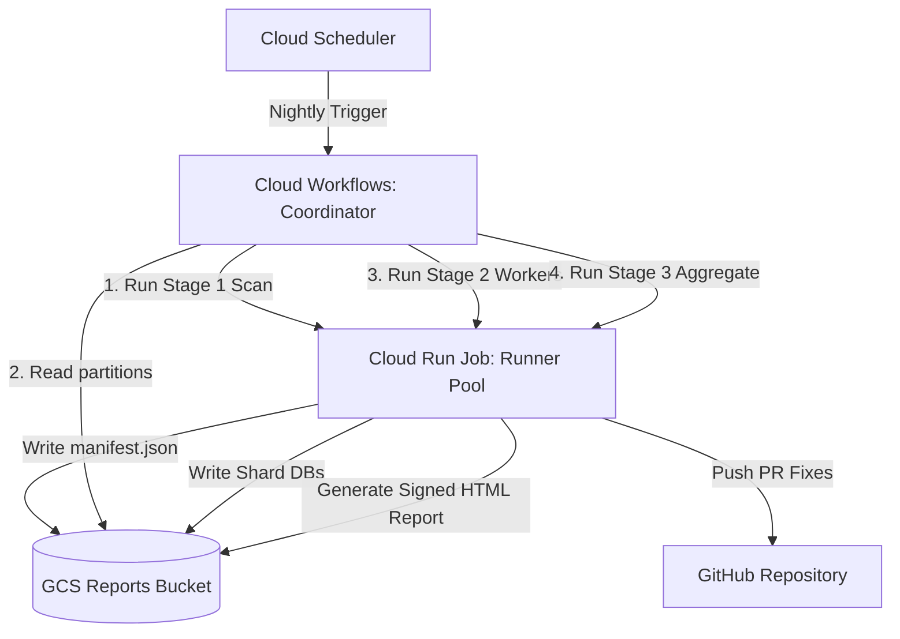

# CodeMender Orchestrator: Automated Terraform Deployment & Parallel Execution Guide

This guide provides step-by-step instructions to setup, deploy, and run the
**CodeMender Orchestrator Parallel Scanning Pipeline** on Google Cloud Platform
(GCP) using Terraform.

--------------------------------------------------------------------------------

## 1. Architecture Overview

The parallel scanning pipeline uses **Infrastructure as Code (IaC)** to
provision:

*   **Google Cloud Storage (GCS)**: Private buckets for binary releases (`releases`) and scan reports (`reports`).
*   **Artifact Registry**: Docker container repository for runner images (`codemender-runner`).
*   **Secret Manager**: Secure storage for GitHub tokens (`GITHUB_APP_TOKEN`).
*   **Service Accounts & Custom IAM**: Ephemeral, least-privilege access for Cloud Run, Cloud Workflows, and Cloud Build.
*   **Cloud Run v2 Job**: Ephemeral runner container pool for `scan`, `worker`, and `aggregate` modes.
*   **Cloud Workflows**: Coordinator workflow orchestrating multi-stage parallel tasks without container timeouts.
*   **Cloud Scheduler**: Nightly trigger for automated repository scanning.
*   *(Optional)* **Serverless VPC Access & Cloud NAT**: Dedicated private network egress routing.



--------------------------------------------------------------------------------

## 2. Prerequisites

Ensure you have the following before starting:

1.  **GCP Project**: An active GCP project with billing enabled.
2.  **Local Tooling**: Installed `gcloud` CLI, `terraform` (v1.3.0+), `git`, and `docker`.
3.  **IAM Permissions**: User account with `Owner` or `Editor` + `Security Admin` privileges on the target GCP project.
4.  **GitHub Token**: A GitHub Personal Access Token (PAT) or GitHub App Token with repository `contents:write` and `pull_requests:write` permissions.

--------------------------------------------------------------------------------

## 3. Step-by-Step Setup & Deployment

### Step 1: Provision Infrastructure with Terraform

Clone the repository and navigate to the `terraform/gcp/` directory:

```bash
git clone https://github.com/your-username/codemender-agent.git
cd codemender-agent/terraform/gcp
```

Create a `terraform.tfvars` file customized for your GCP project:

```hcl
project_id           = "YOUR_GCP_PROJECT_ID"
region               = "us-central1"
resource_prefix      = "codemender"
reports_bucket_name  = "codemender-reports-YOUR_GCP_PROJECT_ID"
releases_bucket_name = "codemender-releases-YOUR_GCP_PROJECT_ID"
create_vpc_and_nat   = false
scheduler_cron       = "0 2 * * *"
```

Initialize and apply the Terraform configuration to provision the GCS buckets, Artifact Registry, Service Accounts, IAM bindings, Cloud Run Job, Workflows, and Secret Manager secret:

```bash
# Initialize provider plugins
terraform init

# Review execution plan
terraform plan

# Provision all infrastructure resources
terraform apply -auto-approve
```

---

### Step 2: Upload CLI Binary to Terraform-Provisioned Releases Bucket

Terraform automatically creates the private GCS Releases Bucket and grants Cloud Build read permissions to it. Upload your compiled `cm-linux` binary directly to the bucket created by Terraform:

```bash
export RELEASES_BUCKET=$(terraform output -raw releases_bucket_name)

# Upload the compiled binary to latest/cm
gcloud storage cp /path/to/cm-linux gs://${RELEASES_BUCKET}/latest/cm
```

---

### Step 3: Build & Push Base Docker Container Image

Return to the repository root directory and build the runner container image using Cloud Build (which fetches `cm` from the GCS Releases bucket):

```bash
cd ../..

# Build and push container image to Artifact Registry
gcloud builds submit --config=cloudbuild.yaml \
    --substitutions=_RELEASES_BUCKET="${RELEASES_BUCKET}" .
```

---

### Step 4: Populate GitHub Access Token in Secret Manager

Terraform initializes the `GITHUB_APP_TOKEN` secret with placeholder data. Update it with your actual GitHub PAT/App token:

```bash
export PROJECT_ID=$(gcloud config get-value project)

echo -n "ghp_your_github_token_here" | \
    gcloud secrets versions add GITHUB_APP_TOKEN \
    --data-file=- \
    --project=${PROJECT_ID}
```

---

### Step 5: Execute Parallel Scan Workflow

Trigger an execution of the `codemender-coordinator` Cloud Workflow for your target repository:

```bash
export REGION="us-central1"
export REPORTS_BUCKET="codemender-reports-${PROJECT_ID}"

gcloud workflows run codemender-coordinator \
    --location=${REGION} \
    --data='{
      "job_name": "codemender-runner",
      "gcs_bucket": "'"${REPORTS_BUCKET}"'",
      "repo_url": "https://github.com/your-org/your-repo.git",
      "build_command": "npm install && npm test",
      "scan_target": ".",
      "max_tasks": 20
    }'
```

---

### Step 6: Monitor Execution & Retrieve Summary Report

1.  **Monitor Workflow Execution**: View real-time state transitions and worker logs:

    ```bash
    gcloud workflows executions list codemender-coordinator --location=${REGION}
    ```

2.  **Access HTML Summary Report**: At the end of Stage 3 (Aggregate), inspect the signed HTML report URL printed in Cloud Logging or retrieve it directly from GCS:

    ```bash
    gcloud storage ls gs://${REPORTS_BUCKET}/scans/
    ```

---

### Step 7: Enable Nightly Scheduled Runs

The provisioned Cloud Scheduler job (`codemender-nightly-scan`) is paused by default. To enable nightly automated scanning:

```bash
gcloud scheduler jobs resume codemender-nightly-scan --location=${REGION}
```

--------------------------------------------------------------------------------

## 4. Troubleshooting & Operational Commands

*   **Update Runner Container Image**: Re-build the image with `gcloud builds submit`. Terraform uses `lifecycle { ignore_changes = [image] }` so image updates will not conflict with Terraform state.
*   **Manual Job Overrides**: Test run a single Cloud Run Job task manually:

    ```bash
    gcloud run jobs execute codemender-runner \
        --region=${REGION} \
        --update-env-vars="CODEMENDER_RUN_MODE=scan,GITHUB_REPO_URL=https://github.com/your-org/your-repo.git"
    ```

*   **Clean Up Resources**: To tear down the infrastructure:

    ```bash
    cd terraform/gcp
    terraform destroy
    ```
