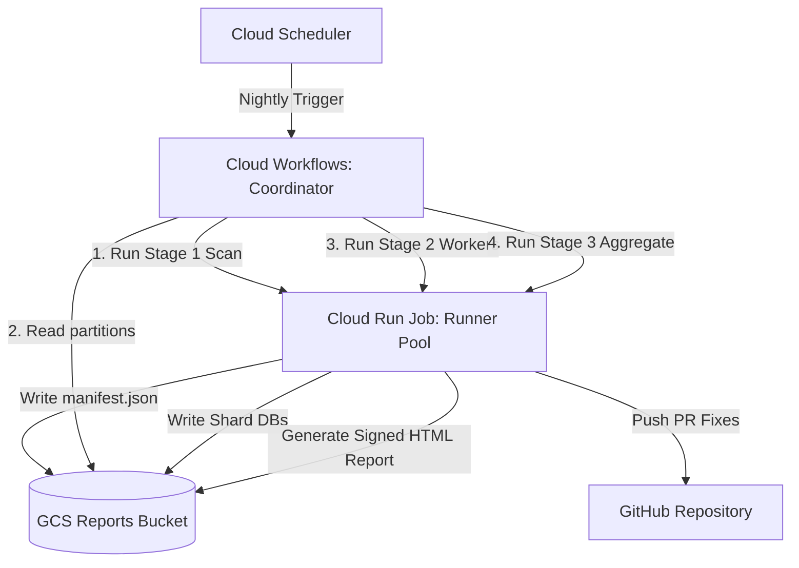

# CodeMender Orchestrator: Automated Terraform Deployment & Parallel Execution Guide

This guide provides step-by-step instructions to setup, deploy, and run the
**CodeMender Orchestrator Parallel Scanning Pipeline** on Google Cloud Platform
(GCP) using Terraform.

--------------------------------------------------------------------------------

## 1. Architecture Overview

The parallel scanning pipeline uses **Infrastructure as Code (IaC)** to
provision:

*   **Google Cloud Storage (GCS)**: Private buckets for binary releases
    (`releases`) and scan reports (`reports`).
*   **Artifact Registry**: Docker container repository for runner images
    (`codemender-runner`).
*   **Secret Manager**: Secure storage for GitHub tokens (`GITHUB_APP_TOKEN`).
*   **Service Accounts & Custom IAM**: Ephemeral, least-privilege access for
    Cloud Run, Cloud Workflows, and Cloud Build.
*   **Cloud Run v2 Job**: Ephemeral runner container pool for `scan`, `worker`,
    and `aggregate` modes.
*   **Cloud Workflows**: Coordinator workflow orchestrating multi-stage parallel
    tasks without container timeouts.
*   **Cloud Scheduler**: Nightly trigger for automated repository scanning.
*   *(Optional)* **Serverless VPC Access & Cloud NAT**: Dedicated private
    network egress routing.



--------------------------------------------------------------------------------

## 2. Prerequisites

Ensure you have the following before starting:

1.  **GCP Project**: An active GCP project with billing enabled.
2.  **Local Tooling**: Installed `gcloud` CLI, `terraform` (v1.3.0+), `git`, and
    `docker`.
3.  **IAM Permissions**: User account with `Owner` or `Editor` + `Security
    Admin` privileges on the target GCP project.
4.  **GitHub Authentication Token**: A valid GitHub token stored in GCP Secret
    Manager (`GITHUB_APP_TOKEN`). CodeMender natively supports either token
    type:

    *   **Option A: Personal Access Token (PAT)**

        *   **Official Documentation**:
            [GitHub Docs: Managing your personal access tokens](https://docs.github.com/en/authentication/keeping-your-account-and-data-secure/managing-your-personal-access-tokens)
        *   **Required Scopes**: `repo` (for classic PATs) OR `Contents: Read
            and write` + `Pull requests: Read and write` (for Fine-grained
            PATs).
        *   **Prefix Format**: Starts with `ghp_...` (classic) or
            `github_pat_...` (fine-grained).
        *   **Lifetime**: Long-lived / static until manually revoked or expired.

    *   **Option B: GitHub App Installation Token**

        *   **Official Documentation**:
            *   [GitHub Docs: About creating GitHub Apps](https://docs.github.com/en/apps/creating-github-apps/about-creating-github-apps/about-creating-github-apps)
            *   [GitHub Docs: Authenticating as a GitHub App Installation](https://docs.github.com/en/apps/creating-github-apps/authenticating-with-a-github-app/authenticating-as-a-github-app-installation)
        *   **Required Permissions**: `Contents: Read & Write`, `Pull Requests:
            Read & Write`, `Metadata: Read-Only`.
        *   **Prefix Format**: Starts with `ghs_...`.
        *   **Lifetime**: Ephemeral (valid for **1 hour**).

--------------------------------------------------------------------------------

## 3. Step-by-Step Setup & Deployment

### Step 1: Provision Infrastructure with Terraform

Clone the repository and navigate to the `terraform/gcp/` directory:

```bash
git clone https://github.com/your-username/codemender-agent.git
cd codemender-agent/terraform/gcp
```

#### Where to create `terraform.tfvars`:

The `terraform.tfvars` file **must be created directly inside
`terraform/gcp/terraform.tfvars`**.

#### Setting Environment Prefix & Cloud Run Resources (`runner_cpu` / `runner_memory`):

Set your project variables, environment prefix, and desired Cloud Run Job
CPU/Memory limits:

```bash
# Set your active GCP Project ID and Environment Prefix
export PROJECT_ID=$(gcloud config get-value project)
export PREFIX="codemender-dev"  # <-- Set your environment prefix here

# Generate terraform.tfvars inside terraform/gcp/
cat <<EOF > terraform.tfvars
project_id           = "${PROJECT_ID}"
region               = "us-central1"
resource_prefix      = "${PREFIX}"
reports_bucket_name  = "${PREFIX}-reports-${PROJECT_ID}"
releases_bucket_name = "${PREFIX}-releases-${PROJECT_ID}"
runner_cpu           = "2"      # Cloud Run Job vCPU limit ("1", "2", "4", "8")
runner_memory        = "4Gi"    # Cloud Run Job RAM limit ("2Gi", "4Gi", "8Gi", "16Gi")
create_vpc_and_nat   = false
scheduler_cron       = "0 2 * * *"
EOF
```

*(Alternatively, create `terraform/gcp/terraform.tfvars` manually using `nano`
or `touch` and set `runner_cpu = "4"` / `runner_memory = "8Gi"`).*

#### Apply Terraform Configuration:

Initialize and apply the Terraform configuration to provision the GCS buckets,
Artifact Registry, Service Accounts, IAM bindings, Cloud Run Job, Workflows,
Secret Manager secret, and enable all required GCP APIs:

```bash
# Initialize provider plugins
terraform init

# Review execution plan
terraform plan

# Provision all infrastructure resources
terraform apply -auto-approve
```

--------------------------------------------------------------------------------

### Step 2: Upload CLI Binary to Terraform-Provisioned Releases Bucket

Terraform automatically creates the private GCS Releases Bucket and grants Cloud
Build read permissions to it. Upload your compiled `cm-linux` binary directly to
the bucket created by Terraform:

```bash
export RELEASES_BUCKET=$(terraform output -raw releases_bucket_name)

# Upload the compiled binary to latest/cm
gcloud storage cp /path/to/cm-linux gs://${RELEASES_BUCKET}/latest/cm
```

--------------------------------------------------------------------------------

### Step 3: Build & Push Base Docker Container Image

Return to the repository root directory (`codemender-agent/`) and build the
runner container image using Cloud Build (which fetches `cm` from GCS Releases
and pushes the container directly to the Artifact Registry repository configured
by Terraform):

```bash
cd ../..

export RELEASES_BUCKET="$(cd terraform/gcp && terraform output -raw releases_bucket_name)"
export REPO_NAME="$(cd terraform/gcp && terraform output -raw runner_job_name 2>/dev/null || echo codemender-runner)"

# Build and push container image to Artifact Registry
gcloud builds submit --config=cloudbuild.yaml \
    --substitutions=_RELEASES_BUCKET="${RELEASES_BUCKET}",_REPO_NAME="${REPO_NAME}" .
```

--------------------------------------------------------------------------------

### Step 4: Populate GitHub Access Token in Secret Manager

Terraform initializes the `GITHUB_APP_TOKEN` Secret Manager secret with
placeholder data (`"PLACEHOLDER"`). Add your actual GitHub PAT or GitHub App
Installation Access Token:

#### Using a GitHub Personal Access Token (PAT):

```bash
export PROJECT_ID=$(gcloud config get-value project)

# Add PAT version (ghp_...) to Secret Manager
echo -n "ghp_your_github_personal_access_token" | \
    gcloud secrets versions add GITHUB_APP_TOKEN \
    --data-file=- \
    --project=${PROJECT_ID}
```

#### Using a GitHub App Installation Token:

```bash
export PROJECT_ID=$(gcloud config get-value project)

# Add GitHub App Installation Access Token (ghs_...) to Secret Manager
echo -n "ghs_your_github_app_installation_token" | \
    gcloud secrets versions add GITHUB_APP_TOKEN \
    --data-file=- \
    --project=${PROJECT_ID}
```

> [!NOTE]
> **Token Expiration Handling**: Because GitHub App Installation Tokens
> (`ghs_...`) expire after 1 hour, automated nightly pipelines using GitHub Apps
> should generate fresh tokens prior to execution using the GitHub App Private
> Key (`.pem`) and App ID, then update Secret Manager via `gcloud secrets
> versions add`.

--------------------------------------------------------------------------------

### Step 5: Execute Parallel Scan Workflow

Trigger an execution of the `codemender-coordinator` Cloud Workflow for your
target repository:

```bash
export REGION="us-central1"
export REPORTS_BUCKET="$(cd terraform/gcp && terraform output -raw reports_bucket_name 2>/dev/null || echo codemender-reports-${PROJECT_ID})"
export JOB_NAME="$(cd terraform/gcp && terraform output -raw runner_job_name 2>/dev/null || echo codemender-runner)"
export WORKFLOW_NAME="$(cd terraform/gcp && terraform output -raw workflow_name 2>/dev/null || echo codemender-coordinator)"

gcloud workflows run ${WORKFLOW_NAME} \
    --location=${REGION} \
    --data='{
      "job_name": "'"${JOB_NAME}"'",
      "gcs_bucket": "'"${REPORTS_BUCKET}"'",
      "repo_url": "https://github.com/your-org/your-repo.git",
      "build_command": "npm install && npm test",
      "scan_target": ".",
      "max_tasks": 20
    }'
```

--------------------------------------------------------------------------------

### Step 6: Monitor Execution & Retrieve Summary Report

1.  **Monitor Workflow Execution**: View real-time state transitions and worker
    logs:

    ```bash
    gcloud workflows executions list ${WORKFLOW_NAME} --location=${REGION}
    ```

2.  **Access HTML Summary Report**: At the end of Stage 3 (Aggregate), inspect
    the signed HTML report URL printed in Cloud Logging or retrieve it directly
    from GCS:

    ```bash
    gcloud storage ls gs://${REPORTS_BUCKET}/scans/
    ```

--------------------------------------------------------------------------------

### Step 7: Enable Nightly Scheduled Runs

The provisioned Cloud Scheduler job is paused by default. To enable nightly
automated scanning:

```bash
export SCHEDULER_JOB_NAME="$(cd terraform/gcp && terraform output -raw scheduler_job_name 2>/dev/null || echo codemender-nightly-scan)"
gcloud scheduler jobs resume ${SCHEDULER_JOB_NAME} --location=${REGION}
```

--------------------------------------------------------------------------------

## 4. Troubleshooting & Operational Commands

*   **Update Runner Container Image**: Re-build the image with `gcloud builds
    submit`.
*   **Manual Job Overrides**: Test run a single Cloud Run Job task manually:

    ```bash
    gcloud run jobs execute ${JOB_NAME} \
        --region=${REGION} \
        --update-env-vars="CODEMENDER_RUN_MODE=scan,GITHUB_REPO_URL=https://github.com/your-org/your-repo.git"
    ```

*   **Clean Up Resources**: To tear down the infrastructure:

    ```bash
    cd terraform/gcp
    terraform destroy
    ```
