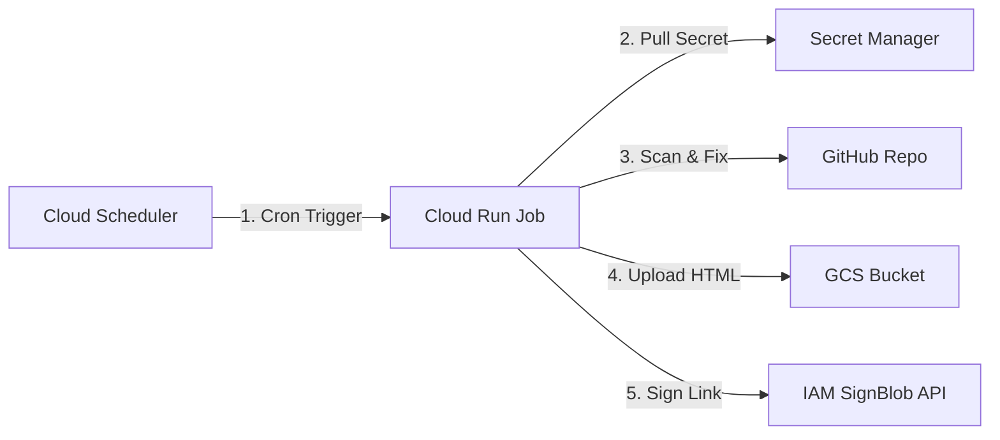

# CodeMender Orchestrator: Production Deployment Guide

This guide details the step-by-step instructions to configure, deploy, and
automate the CodeMender Orchestrator runner in production as a Google Cloud Run
Job.

--------------------------------------------------------------------------------

## Architecture Overview

In production, the orchestrator executes inside an ephemeral container. Here is
how GCS, Secret Manager, and IAM fit together:



--------------------------------------------------------------------------------

## Prerequisites

Before starting, ensure you have:

1.  A **Google Cloud Project** with billing enabled.
2.  The **`gcloud` CLI** installed and authenticated to your project.
3.  A **GitHub Access Token** (PAT or GitHub App Token) with repository write
    permissions.

### Step 0: Enable Required Google Cloud APIs

Execute the following command to enable the APIs required for Cloud Run, Secret
Manager, Cloud Build, and Signed URL generation:

```bash
gcloud services enable \
    run.googleapis.com \
    secretmanager.googleapis.com \
    iamcredentials.googleapis.com \
    artifactregistry.googleapis.com \
    cloudbuild.googleapis.com
```

--------------------------------------------------------------------------------

## Step 1: Clone the Orchestrator Code Repository

Before deploying, you must clone or copy the orchestrator source files (the code
you are currently reading) to your deployment shell environment (e.g. your local
workstation or Google Cloud Shell):

```bash
git clone https://github.com/your-username/codemender-agent.git
cd codemender-agent
```

--------------------------------------------------------------------------------

## Step 2: Create a GCS Releases Bucket & Upload the CLI Binary

Because the `cm` binary is not yet available in a public GCS releases bucket,
you should create a private releases bucket in your project to host it:

```bash
export PROJECT_ID=$(gcloud config get-value project)
export RELEASES_BUCKET="codemender-releases-${PROJECT_ID}"

# Create GCS Releases Bucket in us-central1
gcloud storage buckets create gs://${RELEASES_BUCKET} \
    --location=us-central1 \
    --uniform-bucket-level-access

# Grant the Cloud Build service account permission to read from this private releases bucket
export PROJECT_NUMBER=$(gcloud projects describe ${PROJECT_ID} --format="value(projectNumber)")
gcloud storage buckets add-iam-policy-binding gs://${RELEASES_BUCKET} \
    --member="serviceAccount:${PROJECT_NUMBER}@cloudbuild.gserviceaccount.com" \
    --role="roles/storage.objectViewer"

# Upload your locally compiled cm-linux binary to the bucket
gcloud storage cp /path/to/your/cm-linux gs://${RELEASES_BUCKET}/latest/cm
```

--------------------------------------------------------------------------------

## Step 3: Create a GCS Bucket for Summary Reports

Create a private GCS bucket where the orchestrator will upload the interactive
HTML summary reports:

```bash
export PROJECT_ID=$(gcloud config get-value project)
export BUCKET_NAME="codemender-reports-${PROJECT_ID}"

# Create GCS Bucket
gcloud storage buckets create gs://${BUCKET_NAME} \
    --location=us-central1 \
    --uniform-bucket-level-access
```

--------------------------------------------------------------------------------

## Step 4: Configure Secrets in Secret Manager

Store your GitHub Access Token securely. The orchestrator will fetch it
dynamically at runtime:

```bash
# Create the secret
gcloud secrets create GITHUB_APP_TOKEN --replication-policy="automatic"

# Add your GitHub PAT/Token value
echo -n "ghp_your_github_access_token_here" | \
    gcloud secrets versions add GITHUB_APP_TOKEN --data-file=-
```

--------------------------------------------------------------------------------

## Step 5: Create a Dedicated Service Account (IAM)

To follow the principle of least privilege, do **not** use the default Compute
Engine service account. Create a dedicated service account for the scanner:

```bash
export SA_NAME="codemender-runner-sa"
export SA_EMAIL="${SA_NAME}@${PROJECT_ID}.iam.gserviceaccount.com"

# Create Service Account
gcloud iam service-accounts create ${SA_NAME} \
    --display-name="CodeMender Orchestrator Runner Service Account"
```

### Grant Required IAM Roles:

1.  **Secret Manager Access**: Allow the runner to read the GitHub token.

    ```bash
    gcloud secrets add-iam-policy-binding GITHUB_APP_TOKEN \
        --member="serviceAccount:${SA_EMAIL}" \
        --role="roles/secretmanager.secretAccessor"
    ```

2.  **GCS Write Access**: Allow the runner to write HTML reports to the GCS
    bucket.

    ```bash
    gcloud storage buckets add-iam-policy-binding gs://${BUCKET_NAME} \
        --member="serviceAccount:${SA_EMAIL}" \
        --role="roles/storage.objectCreator"
    ```

3.  **Signed URL SignBlob permission**: To dynamically generate secure,
    temporary v4 Signed URLs without service account key files, the service
    account must have permission to sign payloads on its own behalf.

    ```bash
    gcloud iam service-accounts add-iam-policy-binding ${SA_EMAIL} \
        --member="serviceAccount:${SA_EMAIL}" \
        --role="roles/iam.serviceAccountTokenCreator"
    ```

4.  **Logs Writer Access**: Allow the runner to write execution logs to Cloud
    Logging.

    ```bash
    gcloud projects add-iam-policy-binding ${PROJECT_ID} \
        --member="serviceAccount:${SA_EMAIL}" \
        --role="roles/logging.logWriter"
    ```

5.  **Service Account User (ActAs) Access**: Allow the deploying user to run
    resources as this Service Account.

    ```bash
    export USER_EMAIL=$(gcloud config get-value account)
    gcloud iam service-accounts add-iam-policy-binding ${SA_EMAIL} \
        --member="user:${USER_EMAIL}" \
        --role="roles/iam.serviceAccountUser"
    ```

--------------------------------------------------------------------------------

## Step 6: Build and Push the Docker Container

> [!NOTE] **CodeMender CLI Binary Security**: The releases bucket remains
> completely private. During deployment, Cloud Build uses its own authenticated
> Service Account to securely download the `cm` binary from GCS into the build
> environment before copying it into the container image.

1.  Create a Google Artifact Registry Docker repository (if one does not exist):

    ```bash
    gcloud artifacts repositories create codemender-runner \
        --repository-format=docker \
        --location=us-central1
    ```

2.  Compile and push the container image using Cloud Build (this triggers the
    multi-step `cloudbuild.yaml` flow to fetch the private binary and build the
    container):

    ```bash
    gcloud builds submit --config=cloudbuild.yaml \
        --substitutions=_RELEASES_BUCKET="codemender-releases-${PROJECT_ID}" .
    ```

> [!TIP] **Troubleshooting Permission Denied in Cloud Build**: If the default
> Compute Engine service account (used by Cloud Build) lacks required access to
> staging buckets or image registries: 1. **GCS Access Denied**
> (`storage.objects.get` error): Grant GCS read/write permissions:
>
> ````
> ```bash
> export PROJECT_NUMBER=$(gcloud projects describe ${PROJECT_ID} --format="value(projectNumber)")
> gcloud projects add-iam-policy-binding ${PROJECT_ID} \
>     --member="serviceAccount:${PROJECT_NUMBER}-compute@developer.gserviceaccount.com" \
>     --role="roles/storage.admin"
> ```
> ````
>
> 1.  **Artifact Registry Access Denied**
>     (`artifactregistry.repositories.uploadArtifacts` error): Grant push
>     permissions to upload images:
>
>     ```bash
>     gcloud projects add-iam-policy-binding ${PROJECT_ID} \
>         --member="serviceAccount:${PROJECT_NUMBER}-compute@developer.gserviceaccount.com" \
>         --role="roles/artifactregistry.writer"
>     ```

--------------------------------------------------------------------------------

## Step 7: Deploy the Cloud Run Job

Deploy the container as a Cloud Run Job.

> [!IMPORTANT] **Ephemeral Storage Requirements**: Cloud Run Gen 2 jobs
> automatically provision a default **`10GB` of ephemeral root disk space**,
> which is sufficient for standard builds and cloning. If your target repository
> has a massive dependency tree or build output that requires more than 10GB,
> you must configure a custom volume mount instead of using a direct CLI flag
> (see the scaling note below).

```bash
gcloud run jobs create codemender-scan \
    --image=us-central1-docker.pkg.dev/${PROJECT_ID}/codemender-runner/orchestrator:latest \
    --region=us-central1 \
    --service-account=${SA_EMAIL} \
    --execution-environment=gen2 \
    --task-timeout=1h \
    --memory=4Gi \
    --cpu=2 \
    --set-env-vars="GITHUB_REPO_URL=https://github.com/your-org/your-repo.git,CODEMENDER_BUILD_COMMAND='npm install && npm test',CODEMENDER_REPORT_BUCKET=${BUCKET_NAME}" \
    --set-secrets="GITHUB_APP_TOKEN=GITHUB_APP_TOKEN:latest"
```

> [!TIP] **How to Scale Storage Beyond 10GB**: If you need more storage (e.g.
> 20GB), define a volume of type `ephemeral-disk`, mount it to a directory, and
> tell the orchestrator to use it by setting the `WORKSPACE_DIR` environment
> variable:
>
> ```bash
> gcloud run jobs create codemender-scan \
>     ... \
>     --add-volume=name=scratch,type=ephemeral-disk,size=20Gi \
>     --add-volume-mount=volume=scratch,mount-path=/workspace \
>     --set-env-vars="WORKSPACE_DIR=/workspace,GITHUB_REPO_URL=..."
> ```

--------------------------------------------------------------------------------

## Step 8: Test Execute the Job Manually

To verify everything is working (cloning, fixing, GCS uploads, signed URLs),
trigger the job execution manually:

```bash
gcloud run jobs execute codemender-scan --region=us-central1
```

### Triggering with Overrides (e.g. Overwrite mode / Retrying):

To run a forced scan (ignoring existing branch checks and force-pushing updates
to existing branches):

```bash
gcloud run jobs execute codemender-scan \
    --region=us-central1 \
    --update-env-vars="CODEMENDER_FORCE_OVERWRITE=true"
```

--------------------------------------------------------------------------------

## Step 9: Automate Daily Scans with Cloud Scheduler

Create a scheduled Cloud Scheduler trigger to run the scan automatically every
night (e.g., at 2:00 AM):

```bash
# Create Scheduler Trigger
gcloud scheduler jobs create http codemender-nightly-trigger \
    --location=us-central1 \
    --schedule="0 2 * * *" \
    --uri="https://us-central1-run.googleapis.com/apis/run.googleapis.com/v1/namespaces/${PROJECT_ID}/jobs/codemender-scan:run" \
    --http-method=POST \
    --oauth-service-account-email="${SA_EMAIL}"
```

--------------------------------------------------------------------------------

## Monitoring and Logs

*   **View Run Logs**: Check stdout execution traces directly in Cloud Logging
    or Cloud Run Jobs UI console.
*   **Access Summary Reports**: At the end of the logs, locate the summary
    banner containing the signed URL:

    ```
    ======================================================================
    📊 CODEMENDER SUMMARY REPORT GENERATED:
    👉 https://storage.googleapis.com/codemender-reports-...&Signature=...
    ======================================================================
    ```

    *Note: The signed URL expires automatically after 3 days. Past reports can
    always be accessed directly from the GCS bucket.*

--------------------------------------------------------------------------------

## Adding and Scanning a New Repository

Because the orchestrator is stateless and generic, you **do not** need to
re-create the infrastructure for every repository.

### What you can SKIP:

*   **Step 1 to 5 (Infra & IAM)**: Reuse the existing GCS buckets, Secret
    Manager secrets, and the dedicated service account (`codemender-runner-sa`).
*   **Step 6 (Docker Build)**: You **do not** need to rebuild or push the Docker
    container, *unless* your new repository requires a language runtime (like Go
    or Java) that is not currently enabled in the `Dockerfile` runtime block.

### What you MUST do:

1.  **Deploy a new Cloud Run Job (Step 7)**: Create a new Job with a unique name
    (e.g. suffixing the repository name) and the target configuration:

    ```bash
    export PROJECT_ID=$(gcloud config get-value project)
    export SA_EMAIL="codemender-runner-sa@${PROJECT_ID}.iam.gserviceaccount.com"
    export BUCKET_NAME="codemender-reports-${PROJECT_ID}"

    gcloud run jobs create codemender-scan-[NEW-REPO-NAME] \
        --image=us-central1-docker.pkg.dev/${PROJECT_ID}/codemender-runner/orchestrator:latest \
        --region=us-central1 \
        --service-account=${SA_EMAIL} \
        --execution-environment=gen2 \
        --task-timeout=1h \
        --memory=4Gi \
        --cpu=2 \
        --set-env-vars="GITHUB_REPO_URL=https://github.com/your-org/[NEW-REPO].git,CODEMENDER_BUILD_COMMAND='npm install && npm test',CODEMENDER_REPORT_BUCKET=${BUCKET_NAME}" \
        --set-secrets="GITHUB_APP_TOKEN=GITHUB_APP_TOKEN:latest"
    ```

2.  **Execute manually (Step 8)** to verify build/tests execute successfully:

    ```bash
    gcloud run jobs execute codemender-scan-[NEW-REPO-NAME] --region=us-central1
    ```

3.  **Schedule the new job (Step 9)** using a unique trigger name:

    ```bash
    gcloud scheduler jobs create http codemender-[NEW-REPO-NAME]-trigger \
        --location=us-central1 \
        --schedule="0 3 * * *" \
        --uri="https://us-central1-run.googleapis.com/apis/run.googleapis.com/v1/namespaces/${PROJECT_ID}/jobs/codemender-scan-[NEW-REPO-NAME]:run" \
        --http-method=POST \
        --oauth-service-account-email="${SA_EMAIL}"
    ```
